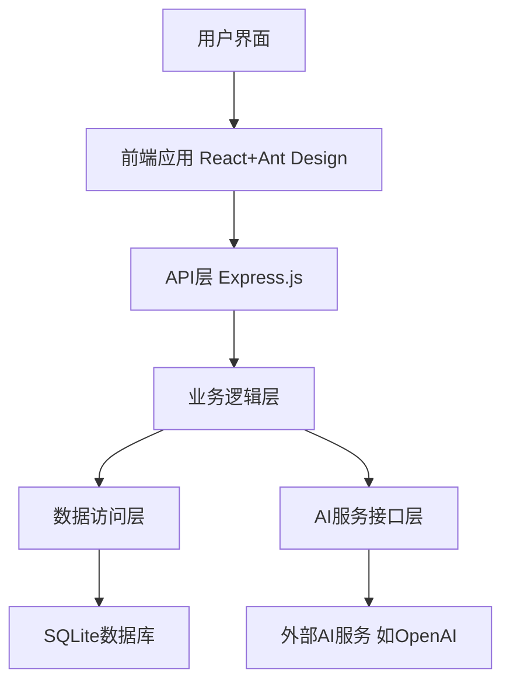

# Netsphere 项目说明文档

**当前版本**: v0.0.3（全局变量模块完成实现）

## 项目简介

Netsphere是一个基于AI的工作流平台，允许用户创建AI驱动的NPC、设计工作任务和编排工作流程。该平台主要面向两类用户：
- **设计者**：创建NPC、工作任务和工作流程
- **使用者**：使用设计好的工作流来满足业务需求

## 核心功能

1. **AI驱动的NPC系统**：用户可设置NPC的知识背景、行动原则和积极性参数
2. **工作任务管理**：设计prompt，分配NPC处理具体任务
3. **工作流编排**：连接多个工作任务，处理复杂需求
4. **全局变量系统**：在任务之间共享和传递数据

## 已完成模块
- **NPC模块** (v1.0.0): 支持NPC创建、编辑、删除和头像上传
- **全局变量模块** (v1.0.0): 支持变量源注册机制、标识符格式规范和多种筛选功能

## 技术栈

### 后端
- **Node.js + Express.js**：简单易用，开发效率高，适合AI调用场景
- **TypeScript**：提供类型安全和代码质量保障

### 前端
- **React**：成熟的前端框架，组件化开发
- **Ant Design**：丰富的UI组件库，确保界面一致性
- **TypeScript**：增强代码质量和可维护性

### 数据库
- **SQLite**：文件型数据库，适合PC本地运行，备份简单

### API接口管理
- **OpenAPI/Swagger**：提供API文档和接口定义，确保接口稳定性

## 项目架构



## 核心模块设计

### 1. NPC管理模块
- NPC创建、编辑、删除
- 知识背景和行动原则的管理
- 积极性参数管理
- 关联文档/图片管理

### 2. 工作任务管理模块
- 任务创建、编辑、删除
- Prompt模板设计器
- NPC分配
- 全局变量引用

### 3. 工作流设计模块
- 流程可视化设计器
- 任务节点连接
- 条件分支
- 执行历史记录

### 4. 全局变量系统
- 变量创建、编辑、删除
- 变量值查看和修改
- 变量使用跟踪

### 5. AI服务集成模块
- 多AI服务商支持
- API密钥管理
- 请求/响应日志

## 开发方法和保障措施

### 版本控制和备份
- 使用Git进行版本控制
- 定期提交代码，清晰的提交信息
- 分支管理策略：主分支(main)保持稳定，新功能在feature分支开发

### 代码质量保障
- TypeScript静态类型检查
- ESLint + Prettier代码格式化
- 单元测试框架(Jest)

### 数据备份
- 自动定时备份数据库文件
- 基于时间戳的备份命名
- 简单的回滚机制

## 开发流程计划

1. **环境搭建与项目初始化**
   - Node.js环境配置
   - 项目脚手架搭建
   - 数据库初始化

2. **核心模块开发**
   - ✅ 先开发NPC管理模块
   - ✅ 实现全局变量系统
   - 再开发工作任务模块
   - 最后开发工作流模块

3. **集成测试与功能验证**
   - 各模块单独测试
   - 全流程集成测试
   - 性能和稳定性验证

## 详细实施计划

### 项目目录结构
```
Netsphere/
├── README.md
├── package.json
├── tsconfig.json
├── .gitignore
├── client/ (前端目录)
│   ├── public/
│   ├── src/
│   │   ├── components/ (UI组件)
│   │   ├── pages/ (页面组件)
│   │   ├── services/ (API服务)
│   │   ├── models/ (数据模型)
│   │   ├── utils/ (工具函数)
│   │   └── App.tsx, index.tsx等
│   ├── package.json
│   └── tsconfig.json
└── server/ (后端目录)
    ├── src/
    │   ├── controllers/ (控制器)
    │   ├── models/ (数据模型)
    │   ├── routes/ (路由)
    │   ├── services/ (业务逻辑)
    │   ├── middlewares/ (中间件)
    │   ├── utils/ (工具函数)
    │   └── index.ts (入口文件)
    ├── database/ (数据库相关)
    ├── package.json
    └── tsconfig.json
```

### 初始化步骤

1. **项目初始化与Git设置**
   ```bash
   # 初始化Git仓库
   cd D:\Netsphere
   git init
   
   # 创建.gitignore文件
   echo "node_modules\n.env\n*.log\n.DS_Store\ndist\nbuild\n*.db" > .gitignore
   ```

2. **后端项目初始化**
   ```bash
   # 创建server目录
   mkdir -p server/src/controllers server/src/models server/src/routes server/src/services server/src/middlewares server/src/utils server/database
   
   # 初始化npm
   cd server
   npm init -y
   
   # 安装核心依赖
   npm install express cors sqlite3 typeorm reflect-metadata dotenv
   
   # 安装开发依赖
   npm install -D typescript ts-node @types/node @types/express @types/cors nodemon
   
   # 创建tsconfig.json
   echo '{
     "compilerOptions": {
       "target": "ES2022",
       "module": "CommonJS",
       "outDir": "./dist",
       "rootDir": "./src",
       "strict": true,
       "esModuleInterop": true,
       "emitDecoratorMetadata": true,
       "experimentalDecorators": true
     },
     "include": ["src/**/*"],
     "exclude": ["node_modules"]
   }' > tsconfig.json
   ```

3. **前端项目初始化**
   ```bash
   # 创建client目录并初始化React应用
   cd ..
   npx create-react-app client --template typescript
   
   # 进入client目录
   cd client
   
   # 安装UI库和其他依赖
   npm install antd @ant-design/icons axios react-router-dom @types/react-router-dom
   
   # 创建必要的目录结构
   mkdir -p src/components src/pages src/services src/models src/utils
   ```

4. **数据库初始化**
   ```bash
   # 在server目录创建数据库配置
   cd ../server
   
   # 创建数据库连接文件
   echo 'import { createConnection } from "typeorm";
   import path from "path";
   
   export const connectDatabase = async () => {
     try {
       const connection = await createConnection({
         type: "sqlite",
         database: path.join(__dirname, "../database/netsphere.db"),
         entities: [path.join(__dirname, "models/**/*.js")],
         synchronize: true,
       });
       console.log("数据库连接成功");
       return connection;
     } catch (error) {
       console.error("数据库连接失败:", error);
       throw error;
     }
   };' > src/database.ts
   ```

### 核心模块开发计划

#### 1. NPC管理模块（优先级：高）

**后端实现**:
- 创建NPC数据模型（src/models/Npc.ts）
- 实现NPC控制器（src/controllers/NpcController.ts）
- 设计NPC路由（src/routes/npc.ts）
- 实现文件上传服务（src/services/FileService.ts）

**前端实现**:
- 创建NPC列表页面（src/pages/npc/NpcList.tsx）
- 创建NPC编辑表单（src/components/npc/NpcForm.tsx）
- 实现NPC API服务（src/services/npcService.ts）

#### 2. 工作任务管理模块（优先级：高）

**后端实现**:
- 创建任务数据模型（src/models/Task.ts）
- 实现任务控制器（src/controllers/TaskController.ts）
- 设计任务路由（src/routes/task.ts）

**前端实现**:
- 创建任务列表页面（src/pages/task/TaskList.tsx）
- 创建任务编辑表单（src/components/task/TaskForm.tsx）
- 实现Prompt编辑器组件（src/components/prompt/PromptEditor.tsx）
- 实现任务API服务（src/services/taskService.ts）

#### 3. 全局变量系统（优先级：中）

**后端实现**:
- 创建变量数据模型（src/models/Variable.ts）
- 实现变量控制器（src/controllers/VariableController.ts）
- 设计变量路由（src/routes/variable.ts）

**前端实现**:
- 创建变量管理页面（src/pages/variable/VariableList.tsx）
- 创建变量编辑表单（src/components/variable/VariableForm.tsx）
- 实现变量选择器组件（src/components/variable/VariableSelector.tsx）
- 实现变量API服务（src/services/variableService.ts）

#### 4. 工作流设计模块（优先级：中）

**后端实现**:
- 创建工作流数据模型（src/models/Workflow.ts, WorkflowNode.ts, WorkflowEdge.ts）
- 实现工作流控制器（src/controllers/WorkflowController.ts）
- 设计工作流路由（src/routes/workflow.ts）
- 实现工作流执行引擎（src/services/WorkflowEngine.ts）

**前端实现**:
- 创建工作流列表页面（src/pages/workflow/WorkflowList.tsx）
- 创建工作流设计器（src/components/workflow/WorkflowDesigner.tsx）
- 实现节点组件（src/components/workflow/WorkflowNode.tsx）
- 实现工作流API服务（src/services/workflowService.ts）

#### 5. AI服务集成模块（优先级：高）

**后端实现**:
- 创建AI服务配置模型（src/models/AiService.ts）
- 实现AI服务控制器（src/controllers/AiServiceController.ts）
- 设计AI服务路由（src/routes/aiService.ts）
- 实现AI调用服务（src/services/AiProviderService.ts）

**前端实现**:
- 创建API密钥管理页面（src/pages/settings/ApiKeys.tsx）
- 实现AI服务选择器（src/components/ai/AiServiceSelector.tsx）
- 实现AI服务API（src/services/aiService.ts）

### 第一阶段实现目标

为快速验证项目概念，第一阶段将优先实现以下功能：

1. **基础架构搭建**
   - 完成前后端项目初始化
   - 设置数据库连接
   - 实现基本的用户界面框架

2. **NPC核心功能**
   - 实现NPC的创建和编辑
   - 支持知识背景和行动原则的设置
   - 简单的文件上传功能

3. **简单工作任务**
   - 基本的任务创建功能
   - 关联NPC到任务
   - 简单的Prompt编辑

4. **AI调用功能**
   - 实现基本的OpenAI API调用
   - 支持API密钥配置
   - 显示AI响应结果

完成这些功能后，用户将能够创建一个NPC，定义一个简单的工作任务，并通过AI执行它，从而验证整个概念的可行性。
