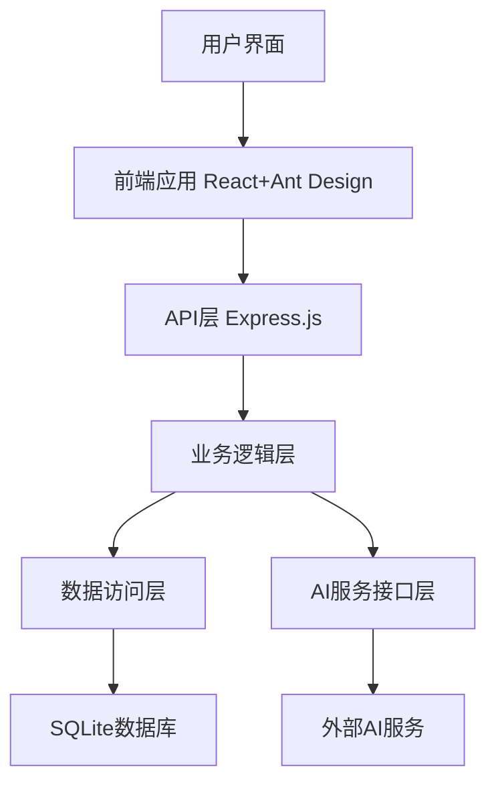

# Netsphere

Netsphere是一个基于AI的工作流平台，用于创建AI驱动的NPC、设计工作任务和编排工作流程。该平台让您可以轻松构建复杂的AI驱动工作流，实现任务自动化和流程优化。

**当前版本**: v0.5.0

## 核心功能

1. **AI驱动的NPC系统**：设置NPC的知识背景、行动原则和积极性参数
2. **工作任务管理**：设计prompt，分配NPC处理具体任务
3. **工作流编排**：连接多个工作任务，处理复杂需求
4. **全局变量系统**：在任务之间共享和传递数据

## 已完成模块
- **NPC模块** (v1.0.0): 支持NPC创建、编辑、删除和头像上传
- **全局变量模块** (v2.2.0): 支持变量源注册机制、UUID标识符格式规范和多种筛选功能
- **工作流模块** (v0.5.0): 支持工作流编辑、执行、可视化和变量同步
   - 五种节点类型：起点卡、工作任务卡、展示卡、赋值卡、循环卡
   - 支持精简/详细两种显示模式
   - 变量同步通知机制
   - 工作任务自动完成机制
   - 循环节点条件判断

## 系统要求

- Node.js 18.x 或更高版本
- npm 9.x 或更高版本

## 快速开始

### 安装

1. 克隆仓库：
```bash
git clone https://github.com/Rainytroy/Netsphere-Open.git
cd Netsphere-Open
```

2. 安装依赖：
```bash
# 安装服务端依赖
cd server
npm install

# 安装客户端依赖
cd ../client
npm install
```

3. 配置环境：
```bash
# 在根目录创建环境配置文件
cp .env.example .env
```
然后编辑`.env`文件，填写必要的配置项，特别是`ENCRYPTION_KEY`用于API密钥加密。

4. 初始化数据库：
```bash
cd server
npm run initdb
```

### 运行

1. 启动服务端：
```bash
cd server
npm run dev
```

2. 启动客户端：
```bash
cd client
npm run dev
```

3. 访问应用：
浏览器打开 `http://localhost:3000`

## AI服务配置

Netsphere需要配置AI服务才能完整运行。目前支持以下AI服务：

- DeepSeek
- 火山引擎

在系统设置页面配置AI服务，需要提供：
1. 服务名称
2. API密钥
3. 基础URL（如有需要）
4. 默认模型选择

## 架构



## 技术栈

### 后端
- **Node.js + Express.js**：提供API服务
- **TypeScript**：提供类型安全和代码质量保障
- **SQLite**：轻量级文件数据库

### 前端
- **React**：用户界面构建
- **Ant Design**：UI组件库
- **TypeScript**：类型安全

## 当前已知问题

1. **循环卡变量判断问题**：目前循环卡的变量判断是有问题的，在节点运行时无法正确获取变量并判断，导致一直判断为No，目前只有运行次数循环才能使用。

2. **节点连接限制**：目前节点除了循环卡，其他卡片都只能接入一个节点，没能正确处理多个节点流向一个节点，或者一个节点分支多个流向的设计。

3. **起点卡自动置入问题**：起点卡不能在创建工作任务后自动置入画布，只能手动拖进去。

4. **工作任务保存问题**：工作任务必须保存后再使用，因为使用按钮没有保存功能，点击使用会是最后一次保存的结果。

5. **工作流执行稳定性**：偶尔工作流运行会卡住。

6. **赋值卡目标变量限制**：当前设计，赋值卡只能赋值给自定义变量，但目前中卡片中的选择器没做限制，选了非自定义变量作为目标变量不会赋值成功。

7. **远程访问配置问题**：设置中的远程访问配置有bug。

## 贡献指南

我们欢迎社区贡献！如果您想参与开发，请按以下步骤操作：

1. Fork项目
2. 创建功能分支：`git checkout -b feature/amazing-feature`
3. 提交更改：`git commit -m 'Add some amazing feature'`
4. 推送到分支：`git push origin feature/amazing-feature`
5. 提交Pull Request

## 许可证

本项目采用GNU通用公共许可证(GPL-3.0) - 详情请参见 [LICENSE](LICENSE) 文件

GPL-3.0是一种强Copyleft许可证，确保所有修改和衍生作品都必须以相同条款开源。这意味着：
- 您可以自由使用、修改和分发此软件
- 您必须以相同的GPL-3.0许可证发布任何修改版本
- 您必须开源任何包含此代码的衍生作品
- 您必须保留版权和许可证声明

我们选择GPL-3.0是为了确保社区共同改进本项目，并使所有改进都保持开源可用。
