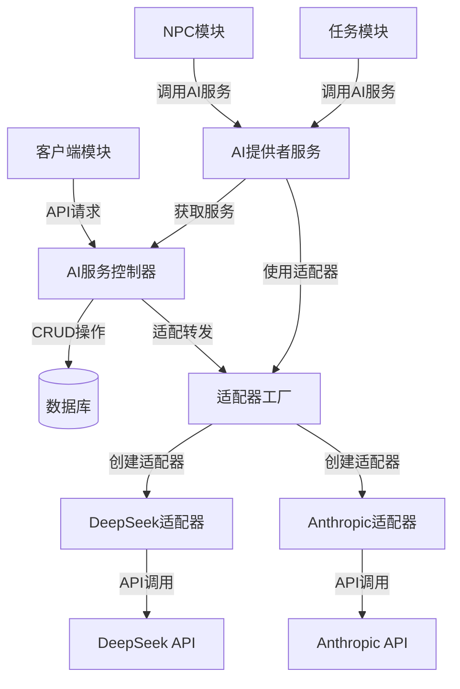
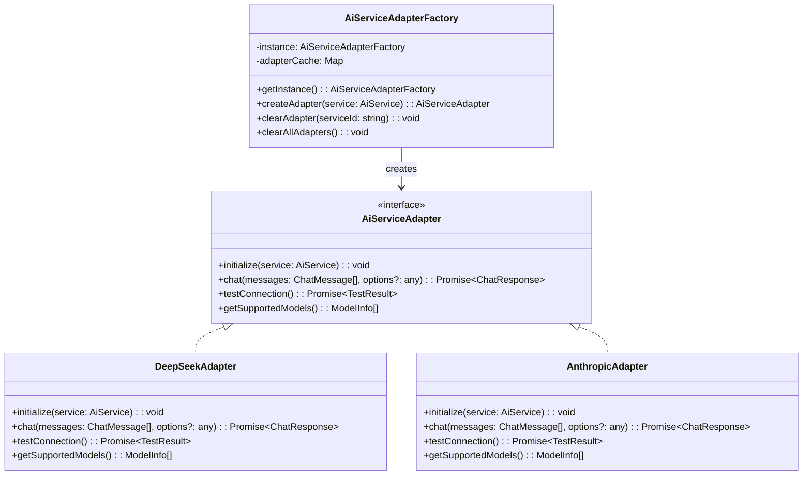

# AI服务模块UI规范与技术开发设计
**版本号**: v1.2.0  
**创建时间**: 2025年3月9日 04:05  
**更新时间**: 2025年3月9日 05:27  
**文档状态**: 已修订  

## 目录
1. [模块概述与目标](#模块概述与目标)
2. [架构设计](#架构设计)
3. [数据模型设计](#数据模型设计)
4. [API接口设计](#api接口设计)
5. [UI规范设计](#ui规范设计)
6. [组件实现规范](#组件实现规范)
7. [安全性考虑](#安全性考虑)
8. [模块集成](#模块集成)
9. [拓展功能考虑](#拓展功能考虑)
10. [实施计划](#实施计划)

## 模块概述与目标

### 概述
AI服务模块是Netsphere平台的核心基础设施，负责管理和统一调用各种AI服务提供商的API。该模块采用适配器模式，将不同AI服务提供商的接口差异抽象封装，提供一致的调用方式，使其他模块能够无缝集成AI能力。

### 核心目标
1. **统一管理**: 集中管理各种AI服务配置，便于维护和切换
2. **安全存储**: 确保API密钥等敏感信息的安全存储
3. **服务适配**: 通过适配器模式支持多种AI服务提供商
4. **易于集成**: 为其他模块提供简单统一的AI调用接口
5. **可视化管理**: 提供友好的用户界面进行配置和测试

### 支持的AI服务提供商
- DeepSeek
- Anthropic Claude
- （未来可扩展更多提供商）

## 架构设计

AI服务模块采用分层架构和适配器设计模式，实现灵活的AI服务集成框架。

### 整体架构图



### 适配器模式实现

适配器模式用于封装不同AI服务提供商的API差异，提供统一的接口：



## 数据模型设计

### AiService模型

```typescript
// AI服务类型枚举
export enum AiServiceType {
  DEEPSEEK = 'deepseek',
  ANTHROPIC = 'anthropic'
  // 未来可扩展其他AI服务类型
}

// AI服务数据模型
export interface AiService {
  id: string;                     // 唯一标识
  name: string;                   // 服务名称（用户自定义）
  type: AiServiceType;            // 服务类型
  apiKey: string;                 // API密钥（加密存储）
  baseUrl?: string;               // 基础URL（可选，部分服务需要）
  defaultModel?: string;          // 默认模型
  config?: Record<string, any>;   // 其他配置参数（如温度、最大token等）
  isDefault?: boolean;            // 是否为默认服务
  createdAt: Date;                // 创建时间
  updatedAt: Date;                // 更新时间
  
  // 方法
  decryptApiKey(): string;        // 解密API密钥
  encryptApiKey(apiKey: string): void; // 加密并设置API密钥
}
```

### 聊天消息接口

```typescript
// 消息角色类型
export type ChatMessageRole = 'system' | 'user' | 'assistant';

// 聊天消息接口
export interface ChatMessage {
  role: ChatMessageRole;
  content: string;
}

// 聊天响应接口
export interface ChatResponse {
  content: string;
  usage?: {
    promptTokens: number;
    completionTokens: number;
    totalTokens: number;
  };
}
```

### 服务配置模板

```typescript
// 服务配置模板（针对不同服务类型的配置项定义）
export const serviceConfigTemplates: Record<AiServiceType, {
  requiresBaseUrl: boolean;
  availableModels: Array<{value: string, label: string}>;
  defaultModel: string;
  configFields: Array<{
    name: string;
    label: string;
    type: 'text' | 'number' | 'select' | 'switch';
    defaultValue: any;
    options?: Array<{value: any, label: string}>;
  }>;
}> = {
  [AiServiceType.DEEPSEEK]: {
    requiresBaseUrl: true,
    availableModels: [
      { value: 'deepseek-chat', label: 'DeepSeek Chat' },
      { value: 'deepseek-reasoner', label: 'DeepSeek Reasoner' }
    ],
    defaultModel: 'deepseek-chat',
    configFields: [
      {
        name: 'temperature',
        label: '温度',
        type: 'number',
        defaultValue: 0.7
      },
      {
        name: 'maxTokens',
        label: '最大Token数',
        type: 'number',
        defaultValue: 2000
      }
    ]
  },
  [AiServiceType.ANTHROPIC]: {
    requiresBaseUrl: false,
    availableModels: [
      { value: 'claude-3-opus-20240229', label: 'Claude 3 Opus' },
      { value: 'claude-3-sonnet-20240229', label: 'Claude 3 Sonnet' },
      { value: 'claude-3-haiku-20240307', label: 'Claude 3 Haiku' }
    ],
    defaultModel: 'claude-3-sonnet-20240229',
    configFields: [
      {
        name: 'temperature',
        label: '温度',
        type: 'number',
        defaultValue: 0.7
      },
      {
        name: 'maxTokens',
        label: '最大Token数',
        type: 'number',
        defaultValue: 4000
      }
    ]
  }
};
```

## API接口设计

### 服务端接口

| 接口路径 | 方法 | 说明 | 权限要求 |
|---------|------|-----|---------|
| `/api/ai-services` | GET | 获取所有AI服务列表 | 需授权 |
| `/api/ai-services/:id` | GET | 获取单个AI服务详情 | 需授权 |
| `/api/ai-services` | POST | 创建新的AI服务 | 需授权 |
| `/api/ai-services/:id` | PUT | 更新现有AI服务 | 需授权 |
| `/api/ai-services/:id` | DELETE | 删除AI服务 | 需授权 |
| `/api/ai-services/:id/default` | PUT | 设置为默认AI服务 | 需授权 |
| `/api/ai-services/default` | GET | 获取默认AI服务 | 需授权 |
| `/api/ai-services/test` | POST | 测试AI服务连接 | 需授权 |
| `/api/ai/chat` | POST | 发送聊天请求 | 需授权 |
| `/api/ai/generate-npc-description` | POST | 生成NPC描述 | 需授权 |

### 客户端服务接口

```typescript
// AI服务API接口
export const aiServiceService = {
  // 获取所有AI服务
  getServices: async (): Promise<ApiResponse<AiService[]>> => {
    try {
      return await apiClient.get<ApiResponse<AiService[]>>('/api/ai-services');
    } catch (error) {
      handleApiError(error);
      throw error;
    }
  },
  
  // 获取单个AI服务
  getService: async (id: string): Promise<ApiResponse<AiService>> => {
    try {
      return await apiClient.get<ApiResponse<AiService>>(`/api/ai-services/${id}`);
    } catch (error) {
      handleApiError(error);
      throw error;
    }
  },
  
  // 创建AI服务
  createService: async (service: Omit<AiService, 'id' | 'createdAt' | 'updatedAt'>): Promise<ApiResponse<AiService>> => {
    try {
      return await apiClient.post<ApiResponse<AiService>>('/api/ai-services', service);
    } catch (error) {
      handleApiError(error);
      throw error;
    }
  },
  
  // 更新AI服务
  updateService: async (id: string, service: Partial<AiService>): Promise<ApiResponse<AiService>> => {
    try {
      return await apiClient.put<ApiResponse<AiService>>(`/api/ai-services/${id}`, service);
    } catch (error) {
      handleApiError(error);
      throw error;
    }
  },
  
  // 删除AI服务
  deleteService: async (id: string): Promise<ApiResponse<void>> => {
    try {
      return await apiClient.delete<ApiResponse<void>>(`/api/ai-services/${id}`);
    } catch (error) {
      handleApiError(error);
      throw error;
    }
  },
  
  // 设置默认AI服务
  setDefault: async (id: string): Promise<ApiResponse<AiService>> => {
    try {
      return await apiClient.put<ApiResponse<AiService>>(`/api/ai-services/${id}/default`);
    } catch (error) {
      handleApiError(error);
      throw error;
    }
  },
  
  // 测试AI服务连接
  testConnection: async (service: Partial<AiService>): Promise<ApiResponse<{success: boolean, message: string}>> => {
    try {
      return await apiClient.post<ApiResponse<{success: boolean, message: string}>>('/api/ai-services/test', service);
    } catch (error) {
      handleApiError(error);
      throw error;
    }
  }
};
```

### 通用API响应格式

为解决TypeScript类型安全问题，定义通用API响应接口：

```typescript
// 通用API响应类型
export interface ApiResponse<T> {
  data: T;
  status: number;
  message?: string;
}
```

## UI规范设计

### 色彩规范
- **主色调**：深蓝色（#1A1F2C，导航背景和主按钮背景）
- **辅助色**：浅灰色（#F5F7FA，页面背景和Avatar背景）
- **强调色**：蓝色（#1890FF，可用于按钮悬停等）
- **警告色**：红色（#FF4D4F，用于删除按钮和警告提示）
- **成功色**：绿色（#52C41A，用于连接成功提示）
- **服务品牌色**：
  - DeepSeek：蓝色（#0078D7）
  - Anthropic：紫色（#6B21A8）
  - 其他品牌根据其官方色彩定义
- **文本色**：
  - 主要文本：#333333
  - 次要文本：#666666
  - 描述文本：#999999
  - 密钥文本：#888888（掩码显示）

### 排版规范
- **字体**：
  - 系统默认字体族："PingFang SC", "Microsoft YaHei", sans-serif
- **字号**：
  - 页面标题：18px, 粗体
  - 表单标签：14px, 常规
  - 输入文本：14px, 常规
  - 按钮文本：14px, 常规
  - 导航菜单：14px, 常规
  - 服务名称：16px, 粗体
  - API密钥（掩码显示）：14px, 等宽字体

### 布局规范
- **间距**：
  - 表单字段间距：24px
  - 导航项间距：16px
  - 卡片间距：24px（固定间距，使用flex布局的gap属性）
- **卡片布局**：
  - 卡片宽度：固定宽度 400px
  - 布局方式：flex布局，自动换行（flexWrap: 'wrap'）
  - 对齐方式：顶部对齐（alignItems: 'flex-start'）
- **响应式断点**：
  - 移动端：< 768px
  - 平板：768px - 1024px
  - 桌面：> 1024px

### 组件规范
- **按钮**：
  - 主按钮：深色背景（#1A1F2C），白色文字，圆角4px
  - 次按钮：白色背景，边框色#D9D9D9，文字色#333333
  - 删除按钮：红色图标（#FF4D4F），悬停时加深
  - 测试连接按钮：蓝色背景（#1890FF），白色文字
- **输入框**：
  - 高度：32px（单行）
  - 边框：1px solid #D9D9D9
  - 圆角：4px
  - 聚焦状态：边框色变为#1890FF
  - 自动完成：禁用（autoComplete="off"）
  - API密钥输入框：带有眼睛图标可切换密码显示/隐藏
- **下拉选择器**：
  - 服务类型选择器：带有各服务Logo图标
  - 下拉菜单最大高度：400px
  - 选项悬停背景色：#F5F7FA
- **卡片**：
  - 背景色：白色
  - 阴影：0 2px 8px rgba(0,0,0,0.08)
  - 圆角：4px
  - 服务Logo：左侧显示，使用Avatar组件
  - Avatar背景色：#F5F7FA（最浅的灰色）
  - 服务状态指示：使用Tag组件，默认服务显示金色标签
- **外框**：
  - 列表内容区域使用Card组件包装，与其他模块保持一致
  - 边距：16px内边距
  - 背景色：白色
  - 阴影：0 1px 2px rgba(0,0,0,0.05)
- **弹窗**：
  - 删除确认弹窗：标题"确认删除"，内容"确定要删除服务 [服务名称] 吗？"
  - 测试连接结果弹窗：显示连接测试的详细结果
  - 按钮：取消（次按钮）和确认（红色警告按钮）
- **消息提示**：
  - 成功提示：绿色背景，用于保存成功等操作
  - 错误提示：红色背景，用于操作失败情况
  - 警告提示：黄色背景，用于注意事项

## 组件实现规范

### 1. 目录结构

AI服务模块遵循项目通用的目录结构规范，代码分布在以下目录：

#### 服务器端
```
/server/src/
  /models/
    AiService.ts            # AI服务模型定义
  /controllers/
    AiServiceController.ts  # AI服务控制器
  /adapters/
    BaseAdapter.ts          # 适配器基础接口
    DeepseekAdapter.ts      # DeepSeek适配器实现
    AnthropicAdapter.ts     # Anthropic适配器实现
  /routes/
    ai-service.ts           # AI服务路由配置
```

#### 客户端
```
/client/src/
  /components/
    /aiService/
      AiServiceList.tsx     # AI服务列表组件
      AiServiceForm.tsx     # AI服务表单组件
      AiServiceSelector.tsx # AI服务选择器组件
  /pages/
    /aiService/
      AiServiceListPage.tsx  # AI服务列表页
      AiServiceCreatePage.tsx # 创建AI服务页
      AiServiceEditPage.tsx   # 编辑AI服务页
  /services/
    aiServiceService.ts     # AI服务API调用服务
```

### 2. 服务端组件

#### AiService模型

```typescript
@Entity()
export class AiService extends BaseEntity {
  @PrimaryGeneratedColumn('uuid')
  id: string;

  @Column()
  name: string;

  @Column({
    type: 'enum',
    enum: AiServiceType,
    default: AiServiceType.DEEPSEEK
  })
  type: AiServiceType;

  @Column()
  private encryptedApiKey: string;

  @Column({ nullable: true })
  baseUrl?: string;

  @Column({ nullable: true })
  defaultModel?: string;

  @Column({ type: 'simple-json', nullable: true })
  config?: Record<string, any>;

  @Column({ default: false })
  isDefault: boolean;

  @CreateDateColumn()
  createdAt: Date;

  @UpdateDateColumn()
  updatedAt: Date;

  // API密钥加密/解密方法
  decryptApiKey(): string {
    return KeyEncryptionService.decrypt(this.encryptedApiKey);
  }

  encryptApiKey(apiKey: string): void {
    this.encryptedApiKey = KeyEncryptionService.encrypt(apiKey);
  }
}
```

#### AiServiceController

```typescript
@Controller('/api/ai-services')
export class AiServiceController {
  constructor(
    private aiServiceRepository: AiServiceRepository,
    private adapterFactory: AiServiceAdapterFactory
  ) {}

  @Get()
  async getAll(): Promise<AiService[]> {
    return this.aiServiceRepository.find();
  }

  @Get('/:id')
  async getOne(@Param('id') id: string): Promise<AiService> {
    const service = await this.aiServiceRepository.findOneBy({ id });
    if (!service) {
      throw new NotFoundException('未找到AI服务');
    }
    return service;
  }

  @Post()
  async create(@Body() data: CreateAiServiceDto): Promise<AiService> {
    // 检查是否已有默认服务
    if (data.isDefault) {
      await this.aiServiceRepository.update(
        { isDefault: true },
        { isDefault: false }
      );
    }

    const service = new AiService();
    service.name = data.name;
    service.type = data.type;
    service.encryptApiKey(data.apiKey);
    service.baseUrl = data.baseUrl;
    service.defaultModel = data.defaultModel;
    service.config = data.config;
    service.isDefault = data.isDefault || false;

    return this.aiServiceRepository.save(service);
  }

  @Put('/:id')
  async update(@Param('id') id: string, @Body() data: UpdateAiServiceDto): Promise<AiService> {
    const service = await this.aiServiceRepository.findOneBy({ id });
    if (!service) {
      throw new NotFoundException('未找到AI服务');
    }

    // 检查是否设置为默认
    if (data.isDefault && !service.isDefault) {
      await this.aiServiceRepository.update(
        { isDefault: true },
        { isDefault: false }
      );
    }

    // 更新属性
    if (data.name) service.name = data.name;
    if (data.type) service.type = data.type;
    if (data.apiKey) service.encryptApiKey(data.apiKey);
    if (data.baseUrl !== undefined) service.baseUrl = data.baseUrl;
    if (data.defaultModel) service.defaultModel = data.defaultModel;
    if (data.config) service.config = data.config;
    if (data.isDefault !== undefined) service.isDefault = data.isDefault;

    return this.aiServiceRepository.save(service);
  }

  @Delete('/:id')
  async delete(@Param('id') id: string): Promise<void> {
    const service = await this.aiServiceRepository.findOneBy({ id });
    if (!service) {
      throw new NotFoundException('未找到AI服务');
    }

    await this.aiServiceRepository.remove(service);
    this.adapterFactory.clearAdapter(id); // 清除适配器缓存
  }

  @Put('/:id/default')
  async setDefault(@Param('id') id: string): Promise<AiService> {
    const service = await this.aiServiceRepository.findOneBy({ id });
    if (!service) {
      throw new NotFoundException('未找到AI服务');
    }

    // 清除其他默认标记
    await this.aiServiceRepository.update(
      { isDefault: true },
      { isDefault: false }
    );

    // 设置新的默认服务
    service.isDefault = true;
    return this.aiServiceRepository.save(service);
  }

  @Get('/default')
  async getDefault(): Promise<AiService> {
    const service = await this.aiServiceRepository.findOneBy({ isDefault: true });
    if (!service) {
      throw new NotFoundException('未设置默认AI服务');
    }
    return service;
  }

  @Post('/test')
  async testConnection(@Body() data: TestConnectionDto): Promise<{success: boolean, message: string}> {
    try {
      // 创建临时服务对象用于测试
      const tempService = new AiService();
      tempService.id = data.id || 'temp-id';
      tempService.type = data.type;
      tempService.encryptApiKey(data.apiKey);
      tempService.baseUrl = data.baseUrl;
      tempService.defaultModel = data.defaultModel;
      tempService.config = data.config;

      // 创建适配器并测试连接
      const adapter = this.adapterFactory.createAdapter(tempService);
      const result = await adapter.testConnection();
      
      // 清除临时适配器
      this.adapterFactory.clearAdapter(tempService.id);
      
      return result;
    } catch (error) {
      return {
        success: false,
        message: `连接测试失败: ${error.message || '未知错误'}`
      };
    }
  }
}
```

### 3. 客户端组件

#### AiServiceList组件
```tsx
interface AiServiceListProps {
  services: AiService[];
  loading?: boolean;
  onEdit: (id: string) => void;
  onDelete: (id: string) => void;
  onSetDefault: (id: string) => void;
}

const AiServiceList: React.FC<AiServiceListProps> = ({
  services,
  loading = false,
  onEdit,
  onDelete,
  onSetDefault
}) => {
  const [deleteModalVisible, setDeleteModalVisible] = useState(false);
  const [selectedService, setSelectedService] = useState<AiService | null>(null);
  
  // 显示删除确认对话框
  const showDeleteConfirm = (service: AiService) => {
    setSelectedService(service);
    setDeleteModalVisible(true);
  };
  
  // 处理删除确认
  const handleDelete = () => {
    if (selectedService && onDelete) {
      onDelete(selectedService.id);
    }
    setDeleteModalVisible(false);
  };
  
  // 服务类型图标映射
  const serviceTypeIcons = {
    [AiServiceType.DEEPSEEK]: <ApiOutlined style={{ color: '#0078D7' }} />,
    [AiServiceType.ANTHROPIC]: <ApiOutlined style={{ color: '#6B21A8' }} />
  };
  
  // Avatar背景色样式
  const avatarStyle = {
    backgroundColor: '#F5F7FA' // 最浅的灰色
  };
  
  // 掩码化API密钥，只显示前4位和后4位
  const maskApiKey = (apiKey: string): string => {
    if (!apiKey) return '••••••••';
    
    if (apiKey.length <= 8) {
      return '••••••••';
    }
    
    return `${apiKey.substring(0, 4)}${'•'.repeat(apiKey.length - 8)}${apiKey.substring(apiKey.length - 4)}`;
  };
  
  // 渲染服务卡片
  const renderServiceCard = (service: AiService) => {
    return (
      <Card
        key={service.id}
        style={{ 
          width: 400,
          boxShadow: '0 2px 8px rgba(0,0,0,0.08)',
        }}
        actions={[
          <Tooltip title="编辑">
            <EditOutlined key="edit" onClick={() => onEdit(service.id)} />
          </Tooltip>,
          <Tooltip title="删除">
            <DeleteOutlined 
              key="delete" 
              style={{ color: '#FF4D4F' }}
              onClick={() => showDeleteConfirm(service)} 
            />
          </Tooltip>,
          service.isDefault ? (
            <Tooltip title="默认服务">
              <StarFilled key="default" style={{ color: '#FAAD14' }} />
            </Tooltip>
          ) : (
            <Tooltip title="设为默认">
              <StarOutlined key="set-default" onClick={() => onSetDefault(service.id)} />
            </Tooltip>
          )
        ]}
      >
        <Card.Meta
          avatar={
            <Avatar icon={serviceTypeIcons[service.type] || <ApiOutlined />} style={avatarStyle} />
          }
          title={
            <Space>
              {service.name}
              {service.isDefault && (
                <Tag color="gold">默认</Tag>
              )}
            </Space>
          }
          description={
            <>
              <div>类型: {getServiceTypeLabel(service.type)}</div>
              <div>模型: {service.defaultModel}</div>
              <div>API密钥: <Typography.Text code>{maskApiKey(service.apiKey)}</Typography.Text></div>
              {service.baseUrl && <div>URL: {service.baseUrl}</div>}
            </>
          }
        />
      </Card>
    );
  };
  
  return (
    <div>
      {loading ? (
        <Spin tip="加载中..." />
      ) : services.length === 0 ? (
        <Empty 
          description="暂无AI服务配置" 
          image={Empty.PRESENTED_IMAGE_SIMPLE}
        />
      ) : (
        <div style={{ 
          display: 'flex', 
          flexWrap: 'wrap', 
          gap: '24px',
          alignItems: 'flex-start'
        }}>
          {services.map(service => (
            <div key={service.id}>
              {renderServiceCard(service)}
            </div>
          ))}
        </div>
      )}
      
      <DeleteConfirmModal
        visible={deleteModalVisible}
        onCancel={() => setDeleteModalVisible(false)}
        onConfirm={handleDelete}
        title="确认删除"
        content={`确定要删除AI服务 ${selectedService?.name} 吗？删除后无法恢
