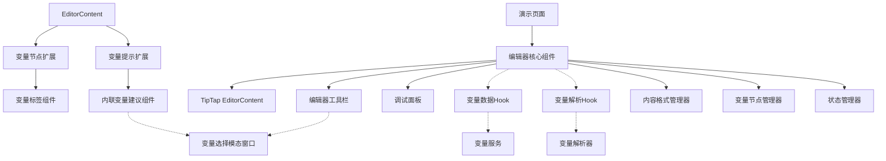
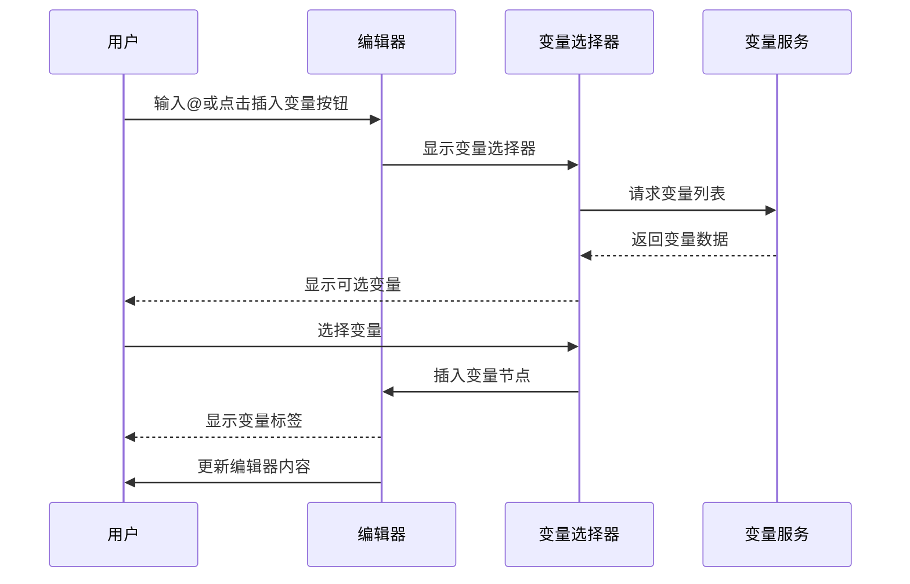
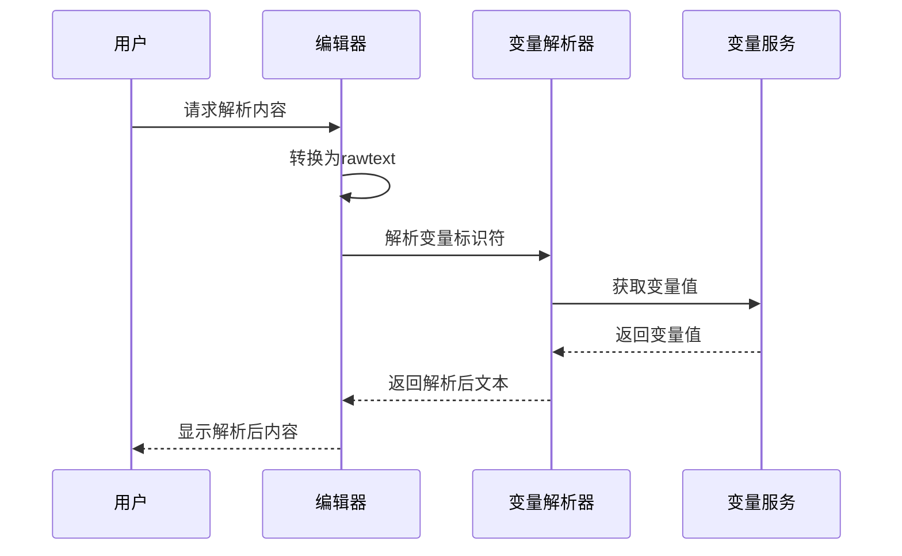
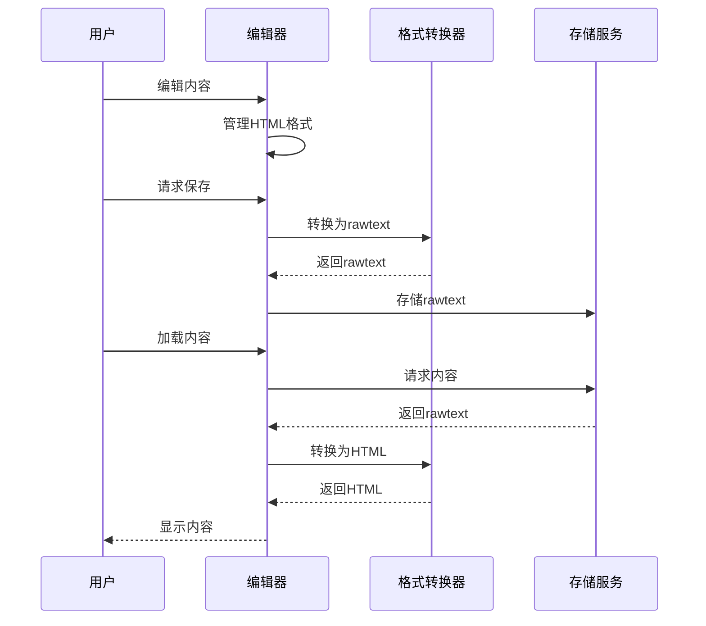

# 变量编辑器VariableEditorX架构设计

**版本**: 1.1.0  
**创建日期**: 2025年3月23日  
**更新日期**: 2025年3月24日  
**文档状态**: 已实现  

## 1. 总体架构

VariableEditorX的架构设计基于模块化和组件化的原则，将各个功能拆分为独立的组件，便于维护和扩展。整体架构采用React组件模型，以TipTap富文本编辑器作为核心基础。

### 1.1 架构图



### 1.2 核心技术栈

- **React**: 用户界面库
- **TipTap**: 基于ProseMirror的富文本编辑器框架
- **TypeScript**: 类型安全的JavaScript超集
- **Ant Design**: UI组件库

## 2. 目录结构

VariableEditorX实现在以下路径：

```
/client/src/pages/demo/variable-editor-x/
├── index.tsx            // 页面入口
├── DemoPage.tsx         // 演示页面
├── VariableEditorX.tsx  // 编辑器核心组件
├── styles.css           // 样式文件
├── types.ts             // 类型定义
├── hooks/
│   ├── useVariableData.ts    // 变量数据获取hook
│   └── useVariableParser.ts  // 变量解析hook
├── components/
│   ├── DebugPanel.tsx        // 测试面板
│   ├── EditorToolbar.tsx     // 工具栏
│   ├── VariableTag.tsx       // 变量标签
│   ├── PreviewModal.tsx      // 预览模态窗口
│   └── VariableSelectorModal.tsx  // 变量选择模态窗口
├── core/
│   ├── EditorCore.tsx        // 编辑器核心组件
│   └── StateManager.ts       // 状态管理器
├── extensions/
│   ├── index.ts              // 扩展导出
│   ├── Variable.ts           // 变量节点扩展
│   └── VariableSuggestion.ts // 变量提示扩展
├── managers/
│   ├── ContentFormatManager.ts  // 内容格式管理器
│   └── VariableNodeManager.ts   // 变量节点管理器
└── utils/
    ├── formatters.ts         // 格式转换工具
    ├── proseMirrorSerializer.ts  // ProseMirror序列化工具
    └── VariableNodeEngine.ts // 变量节点处理引擎
```

## 3. 组件详解

### 3.1 核心组件

#### 3.1.1 VariableEditorX

编辑器的主要组件，负责协调各个子组件并提供统一的API。

**职责**：
- 初始化和配置TipTap编辑器
- 管理编辑器状态
- 提供变量插入和解析功能
- 暴露编辑器API

**接口**：
```typescript
interface VariableEditorXProps {
  initialContent?: string;       // 初始内容
  readOnly?: boolean;            // 是否只读
  onChange?: (content: string) => void;  // 内容变更回调
  onVariableInsert?: (variable: VariableData) => void;  // 变量插入回调
  placeholder?: string;          // 占位文本
  toolbar?: boolean | ToolbarConfig;  // 工具栏配置
  debug?: boolean;               // 是否显示调试面板
  className?: string;            // 自定义类名
  style?: React.CSSProperties;   // 自定义样式
}

interface VariableEditorXRef {
  insertVariable: (variable: VariableData) => void;  // 插入变量
  getContent: () => string;                         // 获取HTML内容
  getRawText: () => string;                         // 获取系统标识符格式内容
  getResolvedContent: () => Promise<string>;        // 获取解析后内容
  focusEditor: () => void;                          // 聚焦编辑器
  clearContent: () => void;                         // 清空内容
  getUsedVariables: () => VariableData[];           // 获取使用的变量
}
```

#### 3.1.2 EditorCore

编辑器核心组件，负责处理基础的TipTap编辑器功能。

**职责**：
- 初始化TipTap编辑器
- 处理编辑器事件（如粘贴、聚焦等）
- 管理编辑器状态和内容

**接口**：
```typescript
interface EditorCoreProps {
  initialContent?: string;       // 初始内容
  readOnly?: boolean;            // 是否只读
  placeholder?: string;          // 占位文本
  onChange?: (html: string) => void;  // 内容变更回调
  onFocus?: () => void;          // 聚焦回调
  onBlur?: () => void;           // 失焦回调
  onVariableSuggestionTrigger?: () => void;  // 变量建议触发回调
  className?: string;            // 自定义类名
  style?: React.CSSProperties;   // 自定义样式
}

interface EditorCoreRef {
  editor: Editor | null;         // TipTap编辑器实例
  getHTML: () => string;         // 获取HTML内容
  getJSON: () => object;         // 获取JSON内容
  getRawText: () => string;      // 获取原始文本
  insertVariable: (variable: VariableData) => void;  // 插入变量
  syncVariableNodes: () => void; // 同步变量节点
  focus: () => void;             // 聚焦编辑器
  clearContent: () => void;      // 清空内容
  isEmpty: () => boolean;        // 检查是否为空
  setContent: (content: string) => void;  // 设置内容
}
```

#### 3.1.3 DemoPage

演示页面，用于展示和测试编辑器功能。

**职责**：
- 提供编辑器的使用示例
- 显示不同格式的内容
- 提供调试和测试功能

### 3.2 管理器组件 (1.1版本新增)

#### 3.2.1 ContentFormatManager

内容格式管理器，负责处理不同格式间的转换。

**职责**：
- HTML ⇔ JSON ⇔ rawText之间的转换
- 内容类型的检测
- 特殊格式的处理

**核心API**：
```typescript
class ContentFormatManager {
  // 检测内容类型
  detectContentType(content: string): 'html' | 'json' | 'text';
  
  // HTML转换为原始文本
  getTextFromHtml(html: string): string;
  
  // 从编辑器获取原始文本
  getRawTextFromEditor(editor: Editor): string;
  
  // 将文本转换为HTML
  convertTextToHtml(text: string): string;
}
```

#### 3.2.2 VariableNodeManager

变量节点管理器，专门处理变量节点的同步和修复。

**职责**：
- 变量节点的创建和插入
- 变量节点的同步（确保DOM和模型一致）
- 修复损坏的变量节点

**核心API**：
```typescript
class VariableNodeManager {
  // 插入变量
  insertVariable(editor: Editor, variable: VariableData): void;
  
  // 同步变量节点
  syncVariableNodes(editor: Editor): void;
  
  // 修复单个变量标签
  repairSingleTag(tag: HTMLElement, variable?: VariableData): void;
}
```

#### 3.2.3 StateManager

状态管理器，负责管理编辑器的状态。

**职责**：
- 管理编辑器状态（如焦点、内容是否为空等）
- 提供状态变更通知
- 与变量事件系统集成

**核心API**：
```typescript
class StateManager {
  // 设置编辑器状态
  setEditorState(state: EditorState): void;
  
  // 获取当前状态
  getState(): EditorState;
  
  // 注册状态变更监听器
  onStateChange(listener: StateChangeListener): void;
}
```

### 3.3 扩展组件

#### 3.3.1 Variable 扩展

TipTap编辑器的自定义节点扩展，用于处理变量标签。1.1版本对此进行了重要改进。

**职责**：
- 定义变量节点的结构和属性
- 提供变量节点的渲染逻辑
- 处理变量节点的交互行为

**1.0版本存在的问题**：
- 渲染HTML时属性值被错误替换为默认值
- 变量标签显示错误，使用默认值而非正确标识符
- 样式应用错误

**1.1版本的改进**：
```typescript
const Variable = Node.create<VariableOptions>({
  name: 'variable',
  group: 'inline',
  inline: true,
  atom: true,  // 设置为atom使其作为整体处理
  
  addAttributes() {
    return {
      id: { 
        default: 'unknown',
        renderHTML: attributes => {
          // 确保始终返回有效属性，不返回空对象
          return { 'data-id': attributes.id || 'unknown' };
        }
      },
      field: {
        default: 'unknown',
        renderHTML: attributes => {
          return { 'data-field': attributes.field || 'unknown' };
        }
      },
      // 其他属性...
    };
  },
  
  renderHTML({ HTMLAttributes }) {
    // 从属性中提取数据
    const id = HTMLAttributes.id || 'unknown';
    const field = HTMLAttributes.field || 'unknown';
    const sourceName = HTMLAttributes.sourceName || 'unknown';
    const sourceType = HTMLAttributes.sourceType || 'system';
    
    // 构建系统标识符
    const systemIdentifier = `@gv_${id}_${field}`;
    // 构建显示标识符
    const displayIdentifier = `@${sourceName}.${field}#${id.substring(0, 4)}`;
    
    // 构建最终属性
    return ['span', {
      'data-variable': '',
      'data-id': id,  // 使用变量而非硬编码
      'data-field': field,
      'data-source-name': sourceName,
      'data-source-type': sourceType,
      'data-identifier': systemIdentifier,
      'class': `variable-tag variable-type-${sourceType}`,
      'contenteditable': 'false'
    }, displayIdentifier];
  }
});
```

#### 3.3.2 VariableSuggestion 扩展

TipTap编辑器的扩展，用于处理@符号触发的变量选择功能。

**职责**：
- 监听@符号输入
- 触发变量选择UI
- 处理变量选择后的插入逻辑

**核心实现**：
```typescript
const VariableSuggestion = Extension.create({
  name: 'variableSuggestion',
  
  addOptions() {
    return {
      suggestion: {
        char: '@',
        command: ({ editor, range }) => {
          // 删除@字符
          editor.chain().focus().deleteRange(range).run();
          // 触发变量选择回调
          this.options.onTriggered?.();
        }
      }
    };
  },
  
  addProseMirrorPlugins() {
    return [
      Suggestion({
        editor: this.editor,
        ...this.options.suggestion,
      }),
    ];
  }
});
```

### 3.4 UI组件

#### 3.4.1 EditorToolbar

编辑器的工具栏组件，提供变量插入和其他功能按钮。

**职责**：
- 显示"插入变量"按钮
- 提供"显示解析值"功能
- 显示编辑器版本号

#### 3.4.2 DebugPanel

调试面板组件，用于展示不同格式的内容和调试信息。

**职责**：
- 显示HTML格式
- 显示JSON格式
- 显示rawText格式
- 显示解析格式
- 显示已使用的变量列表
- 显示编辑器状态

#### 3.4.3 PreviewModal

预览模态窗口，用于展示变量解析后的内容。

**职责**：
- 显示变量值解析后的内容
- 提供关闭按钮

#### 3.4.4 VariableSelectorModal

变量选择模态窗口，用于选择要插入的变量。

**职责**：
- 展示变量列表
- 支持变量搜索和过滤
- 提供变量选择功能

### 3.5 功能Hook

#### 3.5.1 useVariableData

用于获取和管理变量数据的自定义Hook。

**职责**：
- 从API获取变量列表
- 处理变量数据格式
- 提供变量查询功能

**接口**：
```typescript
const useVariableData = () => {
  // 返回变量数据、加载状态和错误信息
  return { 
    variables: VariableData[], 
    loading: boolean, 
    error: Error | null 
  };
};
```

#### 3.5.2 useVariableParser

用于解析变量标识符的自定义Hook。

**职责**：
- 将系统标识符解析为实际值
- 处理不同格式之间的转换
- 提供缓存优化

**接口**：
```typescript
const useVariableParser = () => {
  return {
    parseText: (text: string) => Promise<string>,  // 解析文本中的变量标识符
    convertToHtml: (text: string) => Promise<string>,  // 转换为HTML格式
    convertToRawText: (html: string) => string,  // 转换为rawtext格式
  };
};
```

## 4. 数据流

### 4.1 编辑流程

1. 用户在编辑器中输入文本
2. 用户输入@或点击"插入变量"按钮
3. 显示变量选择器
4. 用户选择变量
5. 编辑器在光标位置插入变量标签
6. 编辑器内部存储变量节点信息
7. 内容变更事件触发onChange回调



### 4.2 解析流程

1. 用户请求解析内容（如点击"显示解析值"按钮）
2. 编辑器将HTML内容转换为rawtext
3. 变量解析器解析标识符为实际值
4. 显示解析后的内容



### 4.3 保存流程

1. 编辑器内容以HTML格式存在
2. 用户保存内容时，转换为rawtext格式
3. 将rawtext格式存储到目标位置
4. 加载内容时，将rawtext转换为HTML格式显示



## 5. 1.1版本的架构改进

### 5.1 Manager模式的引入

1.1版本引入了Manager模式，将特定功能域的逻辑集中在专门的管理器类中：

1. **ContentFormatManager**：负责不同内容格式的转换
2. **VariableNodeManager**：负责变量节点的管理和修复
3. **StateManager**：负责编辑器状态的管理

这种模式的好处：
- 降低了主组件的复杂度
- 提高了代码的可维护性和可测试性
- 使功能逻辑更加内聚

### 5.2 组件拆分

将大型组件拆分为职责更明确的小组件：

1. **VariableEditorX**：主组件，负责组合其他组件
2. **EditorCore**：核心编辑器组件，负责基础编辑功能
3. **UI组件**：如EditorToolbar、DebugPanel等

这种拆分的好处：
- 降低了单个组件的复杂度
- 提高了组件的复用性
- 使代码更易于理解和维护

### 5.3 变量标签渲染机制的改进

针对1.0版本中变量标签渲染的问题，1.1版本进行了重要改进：

1. **重写renderHTML方法**：
   - 使用动态提取的属性值而非硬编码
   - 确保所有必要的数据属性都被设置

2. **完善属性处理**：
   - 确保所有属性处理方法总是返回有效的结果，不返回空对象
   - 添加默认值处理，防止空值导致显示问题

3. **修复逻辑增强**：
   - 添加变量节点同步机制，确保DOM和模型一致
   - 实现标签修复功能，修复损坏的变量标签

## 6. 扩展性考虑

### 6.1 组件可定制性

编辑器的设计考虑了高度的可定制性：

1. **工具栏定制**：通过ToolbarConfig配置显示/隐藏按钮
2. **样式定制**：支持通过className和style属性自定义样式
3. **功能扩展**：核心组件暴露清晰的API，便于扩展

### 6.2 新功能添加方式

当需要添加新功能时，可以通过以下方式扩展：

1. **添加新的TipTap扩展**：创建新的Node或Mark扩展
2. **扩展工具栏**：在EditorToolbar中添加新按钮
3. **增强解析能力**：扩展变量解析器功能

### 6.3 API设计原则

编辑器API设计遵循以下原则：

1. **简单明了**：API名称直观，易于理解
2. **功能完整**：覆盖所有必要的操作
3. **类型安全**：使用TypeScript提供完整的类型定义
4. **向后兼容**：考虑未来扩展，保留扩展空间

## 7. 与现有系统的集成

### 7.1 数据接口

编辑器与现有系统的主要数据接口：

1. **变量数据接口**：通过variableService获取变量列表
2. **内容存储接口**：支持导入/导出rawtext格式内容
3. **解析接口**：使用现有变量解析器处理变量标识符

### 7.2 UI集成

编辑器UI设计与现有系统保持一致：

1. **变量标签样式**：遵循现有变量显示标准
2. **颜色方案**：使用与变量列表页面一致的颜色体系
3. **交互模式**：保持与现有编辑器类似的用户体验

## 8. 1.1版本后续优化方向

1. **性能优化**：
   - 减少不必要的DOM操作
   - 优化变量节点同步逻辑
   - 实现更高效的内容解析算法

2. **可靠性提升**：
   - 增强错误处理和恢复机制
   - 改进边缘情况处理
   - 添加更多单元测试

3. **用户体验优化**：
   - 改进变量选择界面
   - 优化编辑器焦点和交互逻辑
   - 提供更丰富的反馈机制

4. **扩展能力增强**：
   - 支持更多类型的变量
   - 提供更多自定义选项
   - 增强与其他系统的集成能力
