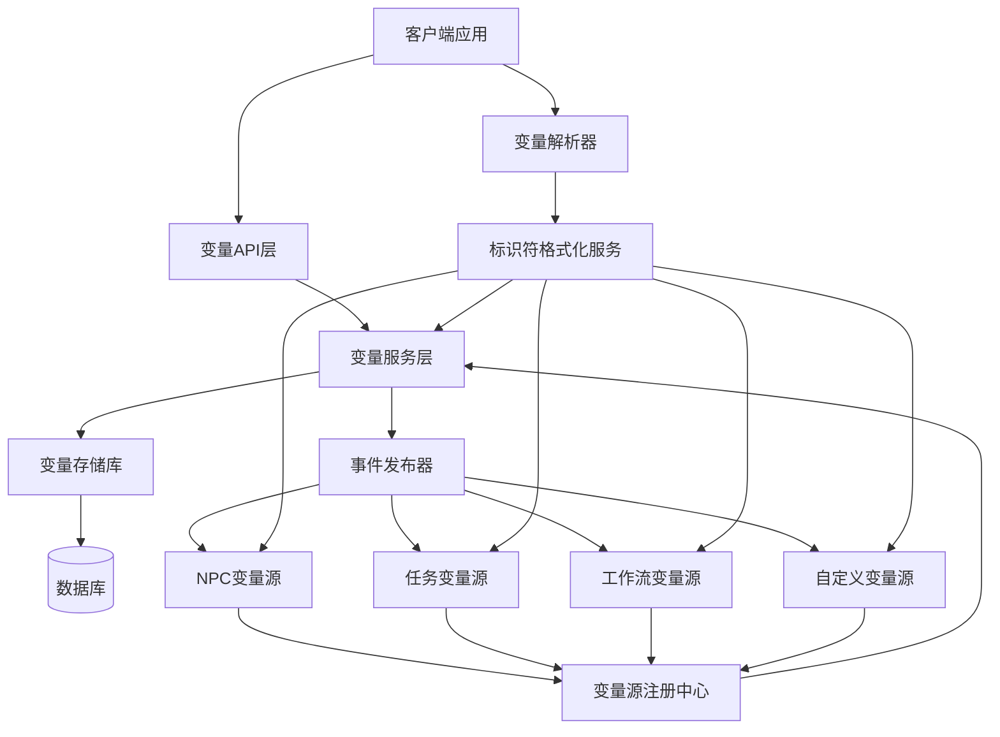

# 全局变量系统设计规范（UUID标识符版）
**版本号**: v2.0.0  
**创建时间**: 2025年3月18日  
**文档状态**: 已定稿  
**关键词**: 全局变量, UUID, 变量标识符, 系统设计

## 目录
1. [系统概述](#系统概述)
2. [变量标识符技术规范](#变量标识符技术规范)
3. [UI设计规范](#ui设计规范)
4. [系统架构设计](#系统架构设计)
5. [核心组件实现](#核心组件实现)
6. [变量源集成指南](#变量源集成指南)
7. [数据流与生命周期](#数据流与生命周期)
8. [变量解析与使用](#变量解析与使用)
9. [迁移策略](#迁移策略)
10. [最佳实践与规范](#最佳实践与规范)

## 系统概述

全局变量系统是Netsphere平台的核心基础设施，为整个系统提供统一的变量管理和访问机制。通过全局变量，各个功能模块（如NPC、工作任务、工作流等）可以将其内部数据作为变量开放给系统中的其他模块使用。

本次系统重构的主要目标是优化变量标识符的稳定性和可靠性，解决因变量来源对象（如NPC、工作任务）名称变更导致的变量引用失效问题。新的变量标识符系统采用基于UUID的格式，确保变量引用的长期稳定性，同时保持良好的用户体验。

### 主要特性

1. **UUID标识符格式**：采用`@gv_UUID`格式作为系统内部标识符，确保变量引用不受源对象名称变更的影响
2. **双重标识符机制**：在系统内部使用UUID标识符，同时保留人类可读的显示标识符（用于UI展示）
3. **兼容性设计**：支持旧格式标识符解析，确保系统平滑过渡
4. **高扩展性**：支持多种变量源提供者的注册与动态加载
5. **统一的变量管理**：提供统一的变量查询、创建、更新和删除接口
6. **变量解析引擎**：高效识别和替换文本中的变量引用

## 变量标识符技术规范

### 1. 标识符格式定义

新系统采用两种格式的变量标识符：

#### 系统标识符（内部使用）
```
@gv_{UUID}
```

- `@` - 统一前缀，标记这是一个变量引用
- `gv_` - 全局变量前缀（global variable）
- `{UUID}` - 变量的唯一标识符，通常是源对象的ID

#### 显示标识符（UI展示）
```
@{sourceName}.{field}#{shortId}
```

- `@` - 统一前缀
- `{sourceName}` - 变量来源对象的名称
- `.` - 固定分隔符
- `{field}` - 字段名称
- `#` - ID分隔符
- `{shortId}` - ID的短版本（4位）

### 2. 标识符示例

| 变量类型 | 来源 | 字段 | 系统标识符 | 显示标识符 |
|---------|------|-----|-----------|------------|
| NPC | 云透 | 知识背景 | `@gv_7f3a81d2-6c8a-4b0f-b1d5-8e7f9a2c1b3d` | `@云透.知识背景#7f3a` |
| 工作流 | 需求分析 | 状态 | `@gv_c5d2e8f1-9a7b-4c6d-8e3f-2a1b0c9d8e7f` | `@需求分析.status#c5d2` |
| 自定义 | 系统设置 | 值 | `@gv_1647932481293` | `@系统设置.value#1293` |

### 3. 标识符生成规则

1. **系统标识符**：
   - 对于所有类型变量，系统标识符使用IdentifierFormatterService的formatIdentifier方法生成
   - 该方法使用源对象的UUID作为核心部分，确保唯一性和稳定性

2. **显示标识符**：
   - 使用IdentifierFormatterService的formatDisplayIdentifier方法生成
   - 针对字符型ID，取前4位作为短标识符
   - 针对数字型ID（如时间戳），取后4位作为短标识符

3. **标识符更新策略**：
   - 当源对象名称变更时，系统标识符保持不变
   - 显示标识符会更新以反映新的源对象名称
   - 这确保了引用稳定性的同时保持UI的一致性和可理解性

### 4. 命名规则与限制

1. **字段名称规范**：
   - NPC类型变量字段：
     * `name` - 名称
     * `description` - 描述
     * `kb` - 知识背景（简化自knowledge_background）
     * `ap` - 行动原则（简化自action_principles）
     * `al` - 活跃度（简化自activity_level）
     * `knowledge` - 知识背景（新增别名）
     * `act` - 行动原则（新增别名）
     * `actlv` - 活跃度（新增别名）

   - 工作任务类型字段：
     * `input` - 输入
     * `output` - 输出
     * `status` - 状态

   - 工作流类型字段：
     * `name` - 名称
     * `description` - 描述
     * `status` - 状态
     * 对节点的引用使用 `node_{nodeId}_{field}` 格式

2. **源名称处理**：
   - 源名称中的特殊字符将被替换为下划线，确保标识符的有效性
   - 支持中文、英文字母、数字和下划线
   - 源名称在显示标识符中保持原格式，以提升可读性

## UI设计规范

### 1. 色彩规范

#### 主要色彩
- **主色调**：深蓝色（#1A1F2C）- 导航背景和主按钮背景
- **辅助色**：浅灰色（#F5F7FA）- 页面背景
- **强调色**：蓝色（#1890FF）- 按钮悬停、选中状态
- **警告色**：红色（#FF4D4F）- 删除按钮和警告提示
- **成功色**：绿色（#52C41A）- 保存成功提示

#### 变量类型色彩
- **NPC类型**：紫色（#722ED1）
- **工作任务类型**：橙色（#FA8C16）
- **工作流类型**：粉紫色（#EB2F96）
- **自定义类型**：蓝色（#1890FF）
- **文件类型**：绿色（#52C41A）

#### 文本色彩
- **主要文本**：#333333
- **次要文本**：#666666
- **描述文本**：#999999
- **标识符文本**：#0050b3（等宽字体）
- **系统标识符**：#888888（较浅色，表示这是系统内部使用）
- **显示标识符**：#0050b3（较深色，表示这是面向用户的）

### 2. 排版规范

- **字体族**：
  ```css
  font-family: "PingFang SC", "Microsoft YaHei", -apple-system, BlinkMacSystemFont, "Segoe UI", Roboto, "Helvetica Neue", Arial, sans-serif;
  ```

- **标识符字体**：
  ```css
  font-family: "SFMono-Regular", Consolas, "Liberation Mono", Menlo, Courier, monospace;
  ```

- **字号规范**：
  - 页面标题：18px, 粗体
  - 区块标题：16px, 粗体
  - 表单标签：14px, 常规
  - 表格表头：14px, 半粗体
  - 表格内容：14px, 常规
  - 变量标识符：13px, 等宽字体
  - 按钮文本：14px, 常规
  - 提示文本：12px, 常规

### 3. 组件设计

#### 标识符显示组件
变量标识符显示组件是新系统中的核心UI元素，它具有以下设计要点：


```jsx
// 标识符显示组件示例代码
const IdentifierBadge = ({ variable }) => {
  // 检查是否有显示标识符，如果没有则使用系统标识符
  const displayId = variable.displayIdentifier || variable.identifier;
  
  return (
    <Tooltip title={variable.value || '无值'} placement="top">
      <div className="identifier-container">
        {/* 显示标识符 */}
        <Typography.Text code ellipsis className="display-identifier">
          {displayId}
        </Typography.Text>
        
        {/* 如果有两种标识符，显示系统标识符（较小字号） */}
        {variable.displayIdentifier && variable.identifier !== variable.displayIdentifier && (
          <Typography.Text type="secondary" className="system-identifier">
            {variable.identifier}
          </Typography.Text>
        )}
        
        {/* 复制按钮 */}
        <Button 
          type="text" 
          size="small"
          icon={<CopyOutlined />} 
          onClick={() => copyToClipboard(variable.identifier)}
          className="copy-button"
        />
      </div>
    </Tooltip>
  );
};
```

#### 变量表格设计
表格中的变量显示经过优化，以同时支持系统标识符和显示标识符：

```jsx
{
  title: '标识符',
  dataIndex: 'identifier',
  key: 'identifier',
  render: (identifier: string, record: Variable) => {
    // 检查是否是新格式标识符 (@gv_UUID)
    if (identifier.startsWith('@gv_')) {
      // 显示系统标识符和可视化标识符（如果有）
      const displayId = (record as any).displayIdentifier;
      
      return (
        <Tooltip title={record.value || '无值'}>
          <div>
            <Typography.Text code ellipsis style={{ maxWidth: '100%', fontSize: '12px', color: '#888' }}>
              {identifier}
            </Typography.Text>
            {displayId && (
              <div>
                <Typography.Text type="secondary" ellipsis style={{ fontSize: '12px' }}>
                  {displayId}
                </Typography.Text>
              </div>
            )}
          </div>
        </Tooltip>
      );
    } else {
      // 旧格式标识符处理
      // 将标识符拆分为主体部分和ID部分
      const parts = identifier.split('#');
      const mainPart = parts[0];
      const idPart = parts.length > 1 ? `#${parts[1]}` : '';
      
      return (
        <Tooltip title={record.value || '无值'}>
          <Typography.Text code ellipsis style={{ maxWidth: '100%' }}>
            {mainPart}
            <span style={{ opacity: 0.3 }}>{idPart}</span>
          </Typography.Text>
        </Tooltip>
      );
    }
  },
  width: 240
}
```

#### 变量选择器组件
为了提升用户体验，变量选择器组件已优化为使用显示标识符进行展示，同时在底层使用系统标识符：

```jsx
// 变量选择器组件（简化版）
const VariableSelector = ({ variables, onChange, value }) => {
  return (
    <Select
      showSearch
      value={value}
      onChange={onChange}
      filterOption={(input, option) => {
        const showName = option.name.toLowerCase();
        const showIdentifier = option.displayIdentifier?.toLowerCase() || option.identifier.toLowerCase();
        return showName.includes(input.toLowerCase()) || showIdentifier.includes(input.toLowerCase());
      }}
    >
      {variables.map(variable => (
        <Select.Option 
          key={variable.identifier} 
          value={variable.identifier}
          name={variable.name}
          displayIdentifier={variable.displayIdentifier}
        >
          <div className="variable-option">
            <TypeIcon type={variable.type} />
            <span className="variable-name">{variable.name}</span>
            <code className="variable-identifier">{variable.displayIdentifier || variable.identifier}</code>
          </div>
        </Select.Option>
      ))}
    </Select>
  );
};
```

### 4. 布局规范

- **表格布局**：
  - 类型列宽度：80px
  - 来源列宽度：120px
  - 名称列宽度：150px
  - 标识符列宽度：240px
  - 值列宽度：自适应（flex: 1）
  - 操作列宽度：120px

- **响应式设计**：
  - 移动端（< 768px）：压缩所有列，优先显示名称和值
  - 平板（768px - 1024px）：标准布局，但值列内容可能折叠
  - 桌面（> 1024px）：完整布局，最佳使用体验

- **间距规范**：
  - 卡片内边距：16px
  - 表单项间距：24px
  - 按钮间距：12px
  - 表格行高：48px

## 系统架构设计

全局变量系统采用模块化、可扩展的架构设计，主要包含以下核心模块：

### 1. 核心架构图



### 2. 核心模块说明

#### 变量服务层（VariableService）
负责变量的CRUD操作，以及从各个变量源收集变量。主要功能包括：
- 变量创建、读取、更新和删除
- 变量数据验证
- 变量重复检查
- 变量来源管理

#### 变量源注册中心（VariableSourceRegistry）
管理所有变量源提供者，提供注册接口和变量源查询功能：
- 源提供者注册与移除
- 收集所有源的变量
- 变量源状态管理
- 支持动态扩展新的变量源

#### 标识符格式化服务（IdentifierFormatterService）
负责变量标识符的生成、解析和转换，是系统的核心组件：
- 系统标识符生成
- 显示标识符生成
- 标识符解析
- 标识符更新（源对象名称变更时）

#### 变量解析器（VariableResolver）
负责在文本中识别和替换变量引用：
- 识别文本中的变量引用（支持新旧两种格式）
- 查找对应的变量值
- 执行变量替换
- 处理未找到变量的情况

#### 事件发布器（VariableEventPublisher）
提供变量相关事件的发布和订阅机制：
- 变量创建事件
- 变量更新事件
- 变量删除事件
- 源对象重命名事件

### 3. 数据流程

1. **变量创建流程**：
   ```mermaid
   sequenceDiagram
     participant SourceModule as 源模块(NPC/任务等)
     participant SourceProvider as 变量源提供者
     participant IdService as 标识符服务
     participant VarService as 变量服务
     participant Database as 数据库
     participant EventPub as 事件发布器
     
     SourceModule->>SourceProvider: 请求创建变量
     SourceProvider->>IdService: 获取标识符
     IdService-->>SourceProvider: 返回系统标识符和显示标识符
     SourceProvider->>VarService: 保存变量
     VarService->>Database: 存储变量
     Database-->>VarService: 存储成功
     VarService->>EventPub: 发布变量创建事件
     EventPub-->>SourceModule: 通知变量创建成功
   ```

2. **变量解析流程**：
   ```mermaid
   sequenceDiagram
     participant Client as 客户端
     participant VarResolver as 变量解析器
     participant VarService as 变量服务
     participant Database as 数据库
     
     Client->>VarResolver: 请求解析文本中的变量
     VarResolver->>VarResolver: 识别变量引用
     VarResolver->>VarService: 获取变量值
     VarService->>Database: 查询变量
     Database-->>VarService: 返回变量
     VarService-->>VarResolver: 返回变量数据
     VarResolver->>VarResolver: 替换文本中的变量引用
     VarResolver-->>Client: 返回解析后的文本
   ```

3. **源对象重命名流程**：
   ```mermaid
   sequenceDiagram
     participant SourceModule as 源模块(NPC等)
     participant IdService as 标识符服务
     participant VarService as 变量服务
     participant Database as 数据库
     participant EventPub as 事件发布器
     
     SourceModule->>IdService: 通知源对象名称变更
     IdService->>VarService: 查找受影响的变量
     VarService->>Database: 查询相关变量
     Database-->>VarService: 返回变量列表
     loop 每个变量
       VarService->>IdService: 更新显示标识符
       VarService->>Database: 保存更新后的变量
     end
     VarService->>EventPub: 发布源重命名事件
     EventPub-->>SourceModule: 通知重命名处理完成
   ```

## 核心组件实现

### 1. IdentifierFormatterService

标识符格式化服务是新系统的核心组件，负责生成和解析变量标识符：

```typescript
/**
 * 标识符格式化服务
 * 负责生成和解析变量标识符的格式
 */
export class IdentifierFormatterService {
  private static instance: IdentifierFormatterService;
  
  /**
   * 获取单例实例
   */
  public static getInstance(): IdentifierFormatterService {
    if (!IdentifierFormatterService.instance) {
      IdentifierFormatterService.instance = new IdentifierFormatterService();
    }
    return IdentifierFormatterService.instance;
  }
  
  /**
   * 根据源类型、源名称、字段和源ID生成新格式的全局变量标识符
   * @param sourceType 源类型
   * @param sourceName 源名称
   * @param field 字段名
   * @param sourceId 源ID (必需)
   * @returns 格式化的标识符
   */
  public formatIdentifier(sourceType: string, sourceName: string, field: string, sourceId: string): string {
    // 确保提供了sourceId
    if (!sourceId) {
      throw new Error('sourceId是必需的参数，不能为空');
    }
    
    // 创建新的全局变量标识符格式 @gv_UUID
    // 使用全局变量前缀 gv_ 加上源ID
    return `@gv_${sourceId}`;
  }
  
  /**
   * 根据源类型、源名称、字段和源ID生成用于显示的标识符
   * 此方法生成的标识符只用于UI显示，不作为系统内标识符使用
   * @param sourceType 源类型
   * @param sourceName 源名称
   * @param field 字段名
   * @param sourceId 源ID (必需)
   * @returns 用于显示的格式化标识符
   */
  public formatDisplayIdentifier(sourceType: string, sourceName: string, field: string, sourceId: string): string {
    // 确保没有非法字符
    const sanitizedSourceName = this.sanitizeName(sourceName);
    
    // 确保提供了sourceId
    if (!sourceId) {
      throw new Error('sourceId是必需的参数，不能为空');
    }
    
    // 获取短标识符（4位）:
    // - 对于时间戳（纯数字），取后4位
    // - 对于其他ID，取前4位
    let shortId;
    if (/^\d+$/.test(sourceId)) {
      // 对于数字ID（通常是时间戳），取后4位
      shortId = sourceId.substring(Math.max(0, sourceId.length - 4));
    } else {
      // 对于其他ID，取前4位
      shortId = sourceId.substring(0, 4);
    }
    
    // 创建带ID的标准显示格式标识符
    return `@${sanitizedSourceName}.${field}#${shortId}`;
  }
  
  /**
   * 解析标识符获取组成部分
   * @param identifier 标识符
   * @returns 解析后的标识符组成部分
   */
  public parseIdentifier(identifier: string): { 
    sourceType: string | null, 
    sourceName: string, 
    field: string,
    sourceId: string | null,
    isNewFormat: boolean
  } {
    // 默认值
    const result = {
      sourceType: null as string | null,
      sourceName: '',
      field: '',
      sourceId: null as string | null,
      isNewFormat: false
    };
    
    // 检查是否是新格式的全局变量标识符 @gv_UUID
    const newFormatRegex = /^@gv_([a-zA-Z0-9-]+)$/;
    const newFormatMatch = identifier.match(newFormatRegex);
    
    if (newFormatMatch) {
      // 如果是新格式，设置sourceId，其他字段为默认值
      result.sourceId = newFormatMatch[1];
      result.isNewFormat = true;
      return result;
    }
    
    // 如果不是新格式，尝试解析为旧格式
    // @源名称.字段 或 @源名称.字段#源ID
    const legacyRegex = /^@([^.]+)\.([^#]+)(?:#([a-zA-Z0-9-]+))?$/;
    const legacyMatch = identifier.match(legacyRegex);
    
    if (!legacyMatch) {
      throw new Error(`Invalid identifier format: ${identifier}`);
    }
    
    result.sourceName = legacyMatch[1];
    result.field = legacyMatch[2].trim(); // 去除可能的空格
    result.sourceId = legacyMatch[3] || null; // 可能不存在ID部分
    
    return result;
  }
  
  /**
   * 批量更新标识符（当源对象重命名时使用）
   * 注意：在新的全局变量体系下，变量标识符不会随着源对象的重命名而改变
   * 但仍需更新变量的源对象名称，以便在UI上正确显示
   * @param oldSourceName 旧源名称
   * @param newSourceName 新源名称
   * @param sourceType 源类型
   */
  public async updateIdentifiers(oldSourceName: string, newSourceName: string, sourceType: string): Promise<void> {
    try {
      // 获取变量仓库
      const variableRepo = AppDataSource.getRepository(Variable);
      
      // 查找所有使用旧源名称的变量
      const variables = await variableRepo.find({
        where: {
          source: {
            type: sourceType,
            name: oldSourceName
          }
        }
      });
      
      if (variables.length === 0) {
        console.log(`未找到名称为 ${oldSourceName} 的变量`);
        return;
      }
      
      // 更新每个变量的来源名称，但保持标识符不变
      const updatedVariables: Variable[] = [];
      
      for (const variable of variables) {
        // 更新源名称
        variable.source.name = newSourceName;
        
        // 在新版本中，标识符不再随源名称变化而变化
        // 但我们可以更新变量的其他信息（如名称）来反映这种变化
        const nameWithSourceName = variable.name.replace(oldSourceName, newSourceName);
        if (nameWithSourceName !== variable.name) {
          variable.name = nameWithSourceName;
        }
        
        // 更新显示标识符（如果存在）
        if ((variable as any).displayIdentifier) {
          (variable as any).displayIdentifier = this.formatDisplayIdentifier(
            sourceType,
            newSourceName,
            variable.name,
            variable.entityId || variable.source.id
          );
        }
        
        // 更新变量
        await variableRepo.save(variable);
        updatedVariables.push(variable);
      }
      
      // 发布源重命名事件
      const eventPublisher = VariableEventPublisher.getInstance();
      eventPublisher.publish(VariableEventType.SOURCE_RENAMED, {
        oldSourceName,
        newSourceName,
        sourceType,
        variables: updatedVariables
      });
      
      console.log(`更新了 ${updatedVariables.length} 个变量`);
    } catch (error) {
      console.error(`更新标识符出错:`, error);
      throw error;
    }
  }
  
  /**
   * 校验名称，去除不合法字符
   * @param name 原始名称
   * @returns 净化后的名称
   */
  private sanitizeName(name: string): string {
    // 移除不允许在标识符中使用的字符，保留字母、数字、汉字和下划线
    return name.replace(/[^a-zA-Z0-9\u4e00-\u9fa5_]/g, '_');
  }
}
```

### 2. VariableResolver

变量解析器负责识别文本中的变量引用并替换为实际值：

```typescript
/**
 * 解析文本中的变量引用 
 * 支持新格式 (@gv_UUID) 和旧格式 (@源名称.字段#ID)
 */
export const resolveVariableReferences = async (
  text: string, 
  options: ResolveOptions = {}
): Promise<string> => {
  const { cacheVariables = true, logProcess = false } = options;
  
  if (!text || typeof text !== 'string') {
    return text;
  }
  
  // 匹配变量引用:
  // 1. 旧格式: @来
