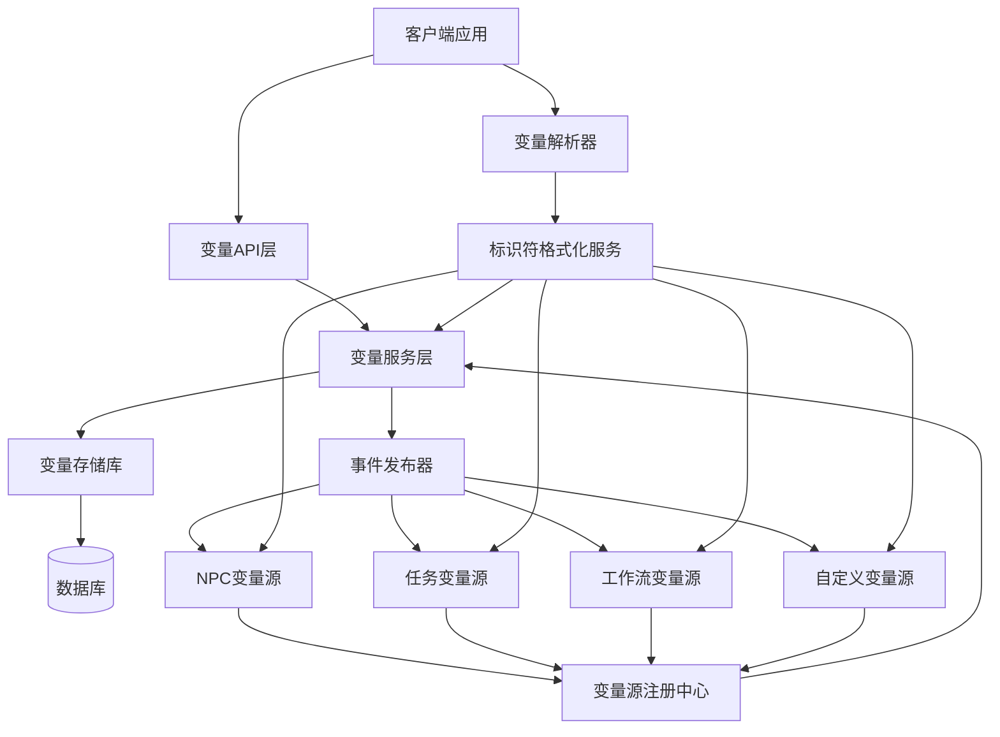
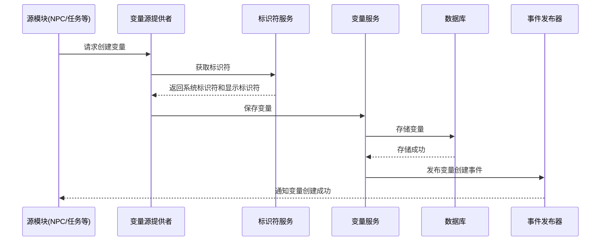
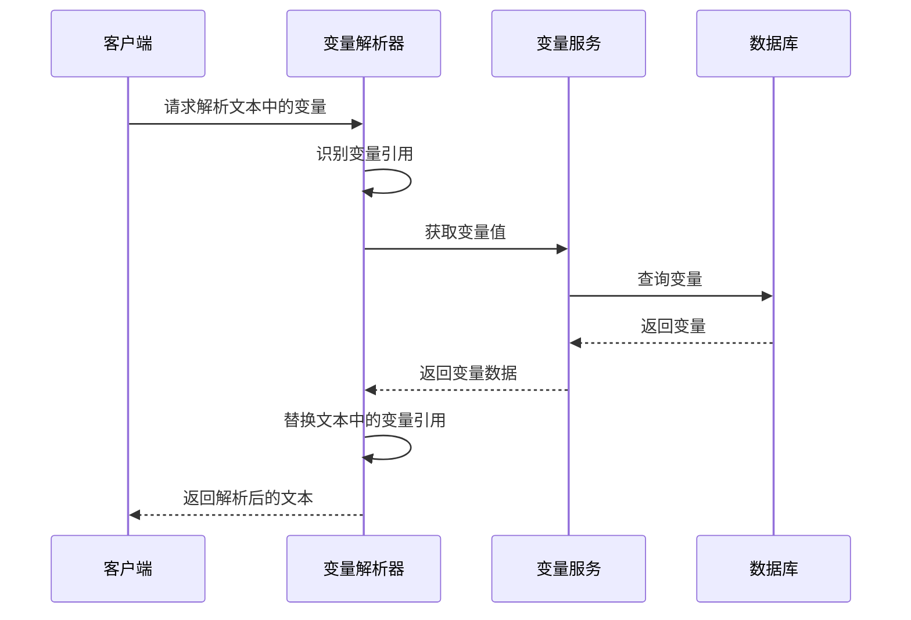
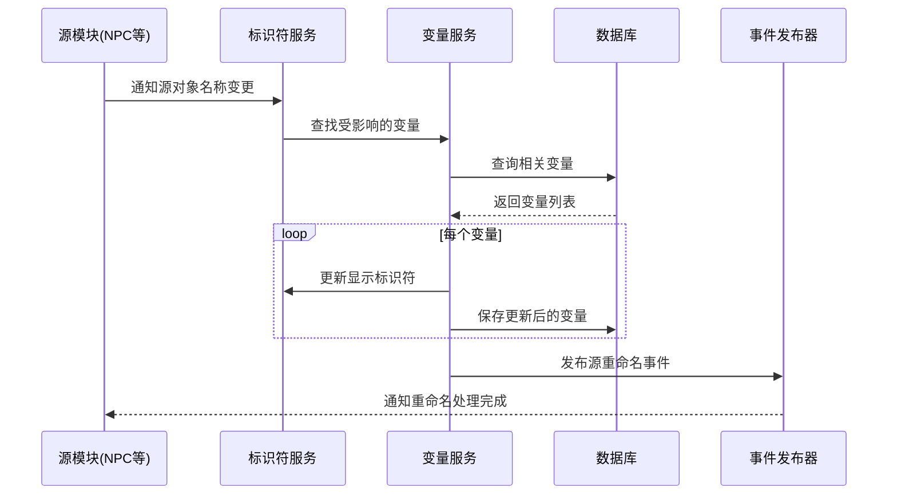

# 全局变量系统架构设计

**版本号**: v2.1.0  
**创建时间**: 2025年3月18日  
**最后更新**: 2025年3月18日  
**文档状态**: 已定稿  
**关键词**: 变量架构, 服务设计, 事件系统

## 架构概述

全局变量系统采用模块化、可扩展的架构设计，主要包含以下核心组件：

1. **VariableService** - 变量服务层，负责变量的CRUD操作
2. **VariableSourceRegistry** - 变量源注册中心，管理所有变量源提供者
3. **IdentifierFormatterService** - 标识符格式化服务，负责生成和解析变量标识符
4. **VariableResolver** - 变量解析器，负责在文本中识别和替换变量引用
5. **VariableEventPublisher** - 事件发布器，提供变量相关事件的发布和订阅机制

### 系统架构图



## 核心组件详解

### 1. 变量服务层（VariableService）

变量服务是系统的中心组件，负责处理变量数据的增删改查操作。

#### 主要职责
- 提供变量的创建、读取、更新和删除操作
- 对变量数据进行验证和处理
- 检查变量重复和冲突
- 管理变量的生命周期

#### 接口定义

```typescript
export interface VariableService {
  // 获取所有变量
  getAllVariables(): Promise<Variable[]>;
  
  // 根据ID获取变量
  getVariableById(id: string): Promise<Variable | null>;
  
  // 根据标识符获取变量
  getVariableByIdentifier(identifier: string): Promise<Variable | null>;
  
  // 创建变量
  createVariable(data: VariableCreateDTO): Promise<Variable>;
  
  // 更新变量
  updateVariable(id: string, data: VariableUpdateDTO): Promise<Variable>;
  
  // 删除变量
  deleteVariable(id: string): Promise<boolean>;
  
  // 同步所有变量源的变量
  syncAllSourceVariables(): Promise<void>;
  
  // 根据源类型同步变量
  syncVariablesBySourceType(sourceType: string): Promise<void>;
}
```

### 2. 变量源注册中心（VariableSourceRegistry）

变量源注册中心管理所有变量源提供者，提供统一的注册和访问接口。

#### 主要职责
- 注册和管理变量源提供者
- 收集所有源的变量
- 提供变量源的查询功能
- 支持动态添加新的变量源

#### 接口定义

```typescript
export interface VariableSourceProvider {
  // 获取该源的所有变量
  getVariables(): Promise<Variable[]>;
  
  // 同步所有变量到数据库
  syncVariablesToDatabase(): Promise<void>;
  
  // 获取源类型
  getSourceType(): string;
  
  // 订阅变化事件
  subscribeToChanges(callback: ChangeCallback): void;
}

export interface VariableSourceRegistry {
  // 注册变量源提供者
  registerProvider(provider: VariableSourceProvider): void;
  
  // 移除变量源提供者
  removeProvider(sourceType: string): void;
  
  // 获取所有变量源提供者
  getAllProviders(): VariableSourceProvider[];
  
  // 根据类型获取变量源提供者
  getProviderByType(sourceType: string): VariableSourceProvider | null;
  
  // 获取所有变量
  getAllVariables(): Promise<Variable[]>;
}
```

### 3. 标识符格式化服务（IdentifierFormatterService）

标识符格式化服务负责生成和解析变量标识符，是新版UUID标识符系统的核心实现。

#### 主要职责
- 生成系统标识符（@gv_UUID_field格式）
- 生成显示标识符（@sourceName.field#shortId格式）
- 解析不同格式的标识符
- 处理标识符更新（当源对象重命名时）

#### 接口定义

```typescript
export interface IdentifierFormatterService {
  // 生成系统标识符
  formatIdentifier(
    sourceType: string, 
    sourceName: string, 
    field: string, 
    sourceId: string
  ): string;
  
  // 生成显示标识符
  formatDisplayIdentifier(
    sourceType: string, 
    sourceName: string, 
    field: string, 
    sourceId: string
  ): string;
  
  // 解析标识符
  parseIdentifier(identifier: string): {
    sourceType: string | null, 
    sourceName: string, 
    field: string,
    sourceId: string | null,
    isNewFormat: boolean
  };
  
  // 批量更新标识符（源对象重命名时）
  updateIdentifiers(
    oldSourceName: string, 
    newSourceName: string, 
    sourceType: string
  ): Promise<void>;
}
```

### 4. 变量解析器（VariableResolver）

变量解析器负责在文本中识别和替换变量引用。系统提供两种实现：服务端实现和客户端实现。

#### 主要职责
- 识别文本中的变量引用
- 查找对应的变量值
- 执行变量替换
- 处理未找到变量的情况

#### 服务端解析器（VariableResolver）

服务端的变量解析器目前主要支持旧格式的`@source.field`形式的变量引用。

```typescript
export interface VariableResolver {
  // 解析文本中的变量引用
  resolveText(text: string, maxDepth?: number): Promise<string>;
  
  // 解析对象中的所有变量引用
  resolveObject(obj: any, maxDepth?: number): Promise<any>;
  
  // 检测文本中是否包含变量引用
  containsVariableReferences(text: string): boolean;
}
```

#### 客户端解析器（ClientVariableResolver）

客户端的变量解析器支持更完整的标识符解析能力，包括新的UUID标识符和显示标识符。

```typescript
export interface ClientVariableResolver {
  // 解析文本中的变量引用
  resolveVariableReferences(
    text: string, 
    options?: ResolveOptions
  ): Promise<string>;
  
  // 清除变量缓存
  clearVariableCache(): void;
  
  // 解析标识符
  parseIdentifier(identifier: string): {
    sourceName: string, 
    field: string,
    sourceId: string | null,
    isNewFormat: boolean 
  };
  
  // 更新文本中的变量标识符
  updateVariableIdentifiers(text: string): Promise<string>;
}

export interface ResolveOptions {
  // 是否缓存变量
  cacheVariables?: boolean;
  
  // 是否记录解析过程
  logProcess?: boolean;
  
  // 是否使用严格匹配模式
  strictMatching?: boolean;
}
```

### 5. 事件发布器（VariableEventPublisher）

事件发布器提供变量相关事件的发布和订阅机制，用于系统内部的消息通信。

#### 主要职责
- 发布变量创建、更新、删除事件
- 发布源对象重命名事件
- 管理事件订阅者
- 分发事件到相关订阅者

#### 接口定义

```typescript
export enum VariableEventType {
  CREATED = 'variable.created',
  UPDATED = 'variable.updated',
  DELETED = 'variable.deleted',
  SOURCE_RENAMED = 'variable.source.renamed'
}

export interface VariableEventPublisher {
  // 发布事件
  publish(eventType: VariableEventType, payload: any): void;
  
  // 订阅事件
  subscribe(
    eventType: VariableEventType, 
    callback: (payload: any) => void
  ): () => void;
  
  // 取消订阅
  unsubscribe(
    eventType: VariableEventType, 
    callback: (payload: any) => void
  ): void;
}
```

## 数据流程

### 1. 变量创建流程



### 2. 变量解析流程



### 3. 源对象重命名流程



## 技术实现细节

### 1. 变量存储

变量使用关系型数据库存储，主要表结构如下：

```sql
CREATE TABLE variables (
  id VARCHAR(36) PRIMARY KEY,
  name VARCHAR(255) NOT NULL,
  value TEXT,
  type VARCHAR(50) NOT NULL,
  source JSON NOT NULL,
  identifier VARCHAR(255) NOT NULL UNIQUE,
  display_identifier VARCHAR(255),
  entity_id VARCHAR(36),
  is_valid BOOLEAN DEFAULT TRUE,
  created_at TIMESTAMP DEFAULT CURRENT_TIMESTAMP,
  updated_at TIMESTAMP DEFAULT CURRENT_TIMESTAMP,
  
  INDEX (type),
  INDEX (entity_id),
  INDEX (identifier)
);
```

### 2. 标识符实现

系统标识符（@gv_UUID_field）的实现代码如下：

```typescript
public formatIdentifier(sourceType: string, sourceName: string, field: string, sourceId: string): string {
  // 确保提供了sourceId
  if (!sourceId) {
    throw new Error('sourceId是必需的参数，不能为空');
  }
  
  // 创建新的全局变量标识符格式 @gv_UUID_field
  // 使用全局变量前缀 gv_ 加上源ID和字段名
  return `@gv_${sourceId}_${field}`;
}
```

显示标识符（@sourceName.field#shortId）的实现代码如下：

```typescript
public formatDisplayIdentifier(sourceType: string, sourceName: string, field: string, sourceId: string): string {
  // 确保没有非法字符
  const sanitizedSourceName = this.sanitizeName(sourceName);
  
  // 确保提供了sourceId
  if (!sourceId) {
    throw new Error('sourceId是必需的参数，不能为空');
  }
  
  // 获取短标识符（4位）:
  // - 对于时间戳（纯数字），取后4位
  // - 对于其他ID，取前4位
  let shortId;
  if (/^\d+$/.test(sourceId)) {
    // 对于数字ID（通常是时间戳），取后4位
    shortId = sourceId.substring(Math.max(0, sourceId.length - 4));
  } else {
    // 对于其他ID，取前4位
    shortId = sourceId.substring(0, 4);
  }
  
  // 创建带ID的标准显示格式标识符
  return `@${sanitizedSourceName}.${field}#${shortId}`;
}
```

### 3. 变量解析性能优化

变量解析器使用了多种优化技术提高处理性能：

1. **正则表达式优化** - 对于客户端解析器，使用预编译正则表达式匹配多种格式的变量引用：

```typescript
// 匹配变量引用:
// 1. 旧格式: @来源.字段 或 @来源.字段#ID 
// 2. 新格式: @gv_UUID_field
const variablePattern = /(?:@([a-zA-Z0-9_\u4e00-\u9fa5]+)\.([a-zA-Z0-9_]+)(?:#([a-zA-Z0-9]{4}))?|@gv_([a-zA-Z0-9-]+)_([a-zA-Z0-9_]+))/g;
```

2. **批量查询** - 一次性查询所有需要的变量，减少多次网络请求：

```typescript
// 批量提取所有变量引用
const identifiers = new Set<string>();
let match;
while ((match = variablePattern.exec(text)) !== null) {
  identifiers.add(match[0]);
}

// 批量查询所有变量
const variables = await variableService.getVariablesByIdentifiers(Array.from(identifiers));
```

3. **变量缓存** - 客户端解析器实现了变量缓存，减少重复请求：

```typescript
// 缓存变量数据，避免重复请求
let cachedVariables: VariableView[] | null = null;

// 获取变量数据时利用缓存
if (cacheVariables && cachedVariables) {
  variables = cachedVariables;
} else {
  // 从服务器获取变量
  // ...
  if (cacheVariables) {
    cachedVariables = variables;
  }
}
```

## 扩展性设计

系统架构的设计考虑到了未来的扩展性，主要体现在以下几方面：

### 1. 新变量源集成

系统可以方便地集成新的变量源，只需实现VariableSourceProvider接口并注册到VariableSourceRegistry：

```typescript
// 新变量源示例
class FileVariableSourceProvider implements VariableSourceProvider {
  // 获取文件变量
  async getVariables(): Promise<Variable[]> {
    // 从文件系统读取文件并转换为变量
    // ...
  }
  
  // 同步变量到数据库
  async syncVariablesToDatabase(): Promise<void> {
    const variables = await this.getVariables();
    await variableService.batchSaveVariables(variables);
  }
  
  // 获取源类型
  getSourceType(): string {
    return 'file';
  }
  
  // 订阅变化
  subscribeToChanges(callback: ChangeCallback): void {
    // 监听文件系统变化
    // ...
  }
}

// 注册新变量源
const fileVariableSource = new FileVariableSourceProvider();
variableSourceRegistry.registerProvider(fileVariableSource);
```

### 2. 客户端变量解析器增强

客户端变量解析器提供了多种可选配置，便于适应不同的使用场景：

```typescript
// 变量解析选项
interface ResolveOptions {
  // 是否缓存变量
  cacheVariables?: boolean;
  
  // 是否记录解析过程
  logProcess?: boolean;
  
  // 是否使用严格匹配模式
  strictMatching?: boolean;
}

// 使用示例
const resolvedText = await resolveVariableReferences(text, {
  cacheVariables: true,      // 启用缓存
  logProcess: true,          // 启用日志
  strictMatching: false      // 使用宽松匹配
});
```

## 相关文档

- [系统概述与标识符规范](./variable-system-overview.md)
- [变量标识符解析规范](./variable-identifier-parsing.md)
- [UI设计规范](./variable-system-ui-design.md)
- [变量源集成指南](./variable-source-integration.md)
- [迁移与最佳实践](./variable-system-migration.md)
