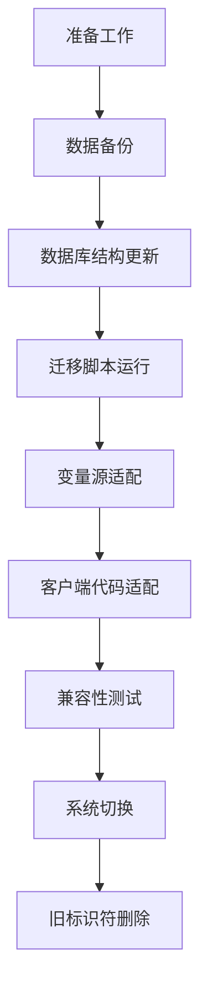

# 全局变量系统迁移与最佳实践

**版本号**: v2.0.0  
**创建时间**: 2025年3月18日  
**文档状态**: 已定稿  
**关键词**: 变量迁移, UUID标识符, 最佳实践

## 迁移概述

本文档详细说明如何从旧版变量标识符格式（`@sourceName.field`或`@sourceName.field#id`）迁移到新的UUID标识符系统（`@gv_UUID`），以及迁移过程中和日常开发中应当遵循的最佳实践。

新的UUID标识符系统解决了以下旧系统问题：

1. **源对象重命名导致引用失效**：旧系统的标识符依赖源对象名称，当源对象重命名时，所有引用会失效
2. **标识符冲突**：不同来源但同名的对象可能产生相同的标识符
3. **特殊字符处理**：源名称中的特殊字符需要额外处理
4. **长期稳定性**：系统无法确保标识符的长期稳定性

## 迁移策略

### 1. 迁移流程

迁移过程分为以下几个主要阶段：



### 2. 迁移准备

在开始迁移之前，需要完成以下准备工作：

- 完成所有模块的开发和测试
- 确保数据库备份机制正常工作
- 准备回滚方案
- 与相关团队确认迁移时间

### 3. 数据库结构更新

在进行数据迁移前，需要更新数据库结构以支持新的UUID标识符：

```sql
-- 变量表结构更新
ALTER TABLE variables ADD COLUMN display_identifier VARCHAR(255);
ALTER TABLE variables ADD COLUMN legacy_identifier VARCHAR(255);
```

### 4. 迁移脚本

迁移过程使用专门的迁移脚本（`migrate-variables-to-uuid.ts`）处理数据转换：

```typescript
/**
 * 变量标识符迁移脚本
 * 将变量从旧格式标识符迁移到新的UUID格式标识符
 */
export async function migrateVariablesToUuid() {
  try {
    console.log('开始变量标识符迁移...');
    
    // 1. 获取所有变量
    const variableRepo = AppDataSource.getRepository(Variable);
    const variables = await variableRepo.find();
    
    console.log(`找到 ${variables.length} 个变量需要迁移`);
    
    // 获取标识符格式化服务
    const identifierFormatter = IdentifierFormatterService.getInstance();
    
    // 2. 迁移每个变量
    let successCount = 0;
    let errorCount = 0;
    
    for (const variable of variables) {
      try {
        // 保存旧标识符
        const oldIdentifier = variable.identifier;
        
        // 解析旧标识符
        const { sourceName, field, sourceId } = identifierFormatter.parseIdentifier(oldIdentifier);
        
        // 确定正确的sourceId
        const actualSourceId = variable.entityId || (variable.source && variable.source.id) || sourceId;
        
        if (!actualSourceId) {
          console.error(`无法为变量 ${variable.id} (${oldIdentifier}) 确定sourceId`);
          errorCount++;
          continue;
        }
        
        // 创建新的标识符
        const newIdentifier = identifierFormatter.formatIdentifier(
          variable.source.type,
          sourceName,
          field,
          actualSourceId
        );
        
        // 创建显示标识符
        const displayIdentifier = identifierFormatter.formatDisplayIdentifier(
          variable.source.type,
          sourceName,
          field,
          actualSourceId
        );
        
        // 更新变量
        variable.legacy_identifier = oldIdentifier;
        variable.identifier = newIdentifier;
        variable.display_identifier = displayIdentifier;
        
        // 保存变量
        await variableRepo.save(variable);
        
        console.log(`已迁移: ${oldIdentifier} -> ${newIdentifier}`);
        successCount++;
      } catch (error) {
        console.error(`迁移变量 ${variable.id} 失败:`, error);
        errorCount++;
      }
    }
    
    console.log(`迁移完成: ${successCount} 成功, ${errorCount} 失败`);
    
    return {
      totalCount: variables.length,
      successCount,
      errorCount
    };
  } catch (error) {
    console.error('变量标识符迁移失败:', error);
    throw error;
  }
}
```

### 5. 迁移执行

迁移脚本可以通过专门的命令行工具执行：

```bash
# 执行迁移脚本
node dist/scripts/run-migration.js

# 或使用npm脚本
npm run migrate:variables
```

## 兼容性机制

为确保系统平稳过渡，新系统实现了以下兼容性机制：

### 1. 双重标识符支持

系统支持新旧两种标识符格式：

```typescript
// 变量解析器中的双重格式支持
const resolveVariable = async (identifier: string): Promise<string | null> => {
  // 1. 首先尝试使用新格式UUID标识符查找
  let variable = await variableService.getVariableByIdentifier(identifier);
  
  // 2. 如果未找到，尝试使用旧格式标识符查找
  if (!variable && !identifier.startsWith('@gv_')) {
    // 查找旧格式标识符
    variable = await variableService.getVariableByLegacyIdentifier(identifier);
  }
  
  return variable ? variable.value : null;
};
```

### 2. 旧格式标识符重定向

系统会自动将旧格式标识符重定向到新标识符：

```typescript
// 标识符重定向中间件
export const legacyIdentifierRedirect = async (req, res, next) => {
  if (req.params.identifier && !req.params.identifier.startsWith('@gv_')) {
    const variable = await variableService.getVariableByLegacyIdentifier(req.params.identifier);
    if (variable) {
      // 重定向到新的标识符URL
      return res.redirect(`/api/variables/${variable.identifier}`);
    }
  }
  next();
};
```

### 3. 自动更新工具

提供自动更新工具帮助开发者更新代码中的变量引用：

```typescript
// 引用更新工具示例
export const updateVariableReferences = async (filePath: string): Promise<void> => {
  try {
    // 读取文件内容
    const content = await fs.readFile(filePath, 'utf8');
    
    // 获取所有变量的映射关系
    const variableRepo = AppDataSource.getRepository(Variable);
    const variables = await variableRepo.find({
      where: {
        legacy_identifier: Not(IsNull())
      }
    });
    
    // 创建映射表
    const identifierMap = new Map<string, string>();
    for (const variable of variables) {
      if (variable.legacy_identifier) {
        identifierMap.set(variable.legacy_identifier, variable.identifier);
      }
    }
    
    // 使用正则表达式替换所有旧标识符
    let updatedContent = content;
    const varPattern = /@[^.]+\.[^#\s]+(?:#[a-zA-Z0-9-]+)?/g;
    
    updatedContent = updatedContent.replace(varPattern, (match) => {
      return identifierMap.get(match) || match;
    });
    
    // 如果内容有变化，写回文件
    if (updatedContent !== content) {
      await fs.writeFile(filePath, updatedContent, 'utf8');
      console.log(`已更新文件: ${filePath}`);
    }
  } catch (error) {
    console.error(`更新文件 ${filePath} 失败:`, error);
    throw error;
  }
};
```

## 开发最佳实践

### 1. 变量引用

#### 使用系统标识符

在代码中引用变量时，应该使用系统标识符（@gv_UUID格式）：

```typescript
// 推荐
const npcKnowledge = await resolveVariable('@gv_7f3a81d2-6c8a-4b0f-b1d5-8e7f9a2c1b3d');

// 不推荐
const npcKnowledge = await resolveVariable('@云透.知识背景');
```

#### 在UI中展示显示标识符

在用户界面中，应当使用显示标识符：

```jsx
// 在UI中展示变量时使用displayIdentifier
<Typography.Text code>
  {variable.displayIdentifier || variable.identifier}
</Typography.Text>
```

#### 变量选择组件

使用标准的变量选择组件，它会自动处理标识符的显示和保存：

```jsx
<VariableSelector 
  value={selectedVariable} 
  onChange={setSelectedVariable}
  sourceTypes={['npc', 'workflow']} // 可选，过滤变量源类型
/>
```

### 2. 变量创建

#### 使用标识符格式化服务

创建变量时，使用标识符格式化服务生成正确的标识符：

```typescript
// 创建变量示例
const createEntityVariable = (entity, field, value) => {
  const identifierFormatter = IdentifierFormatterService.getInstance();
  
  // 生成系统标识符
  const identifier = identifierFormatter.formatIdentifier(
    'entity_type',
    entity.name,
    field,
    entity.id
  );
  
  // 生成显示标识符
  const displayIdentifier = identifierFormatter.formatDisplayIdentifier(
    'entity_type',
    entity.name,
    field,
    entity.id
  );
  
  return {
    name: `${entity.name} - ${field}`,
    value: value,
    type: 'entity_type',
    source: {
      type: 'entity_type',
      id: entity.id,
      name: entity.name
    },
    identifier: identifier,
    displayIdentifier: displayIdentifier,
    entityId: entity.id
  };
};
```

#### 存储实体ID

确保在创建变量时存储实体ID，这对于将来的标识符更新至关重要：

```typescript
// 正确设置entityId
variable.entityId = entity.id;
```

### 3. 处理源对象重命名

当源对象重命名时，需要更新相关变量的显示标识符：

```typescript
// 源对象重命名处理示例
const handleEntityRename = async (entityId, oldName, newName) => {
  const identifierFormatter = IdentifierFormatterService.getInstance();
  await identifierFormatter.updateIdentifiers(oldName, newName, 'entity_type');
};
```

### 4. 测试与验证

#### 标识符解析测试

编写测试确保标识符解析正确：

```typescript
// 标识符解析测试
describe('Identifier Resolution', () => {
  it('should resolve variable by UUID identifier', async () => {
    const variable = await variableService.getVariableByIdentifier('@gv_123456');
    expect(variable).not.toBeNull();
    expect(variable.value).toBe('expected value');
  });
  
  it('should resolve variable by display identifier', async () => {
    const variable = await variableService.getVariableByDisplayIdentifier('@test.field#1234');
    expect(variable).not.toBeNull();
    expect(variable.identifier).toStartWith('@gv_');
  });
});
```

#### 性能考量

进行性能测试，确保新系统的性能不低于旧系统：

```typescript
// 性能测试示例
describe('Performance Tests', () => {
  it('should resolve 1000 variables within acceptable time', async () => {
    const start = Date.now();
    
    const text = generateTextWithVariables(1000);
    const result = await resolveVariableReferences(text);
    
    const duration = Date.now() - start;
    expect(duration).toBeLessThan(1000); // 应在1秒内完成
  });
});
```

## 常见问题与解决方案

### 1. 迁移问题

#### 标识符冲突

**问题**：迁移过程中出现标识符冲突。  
**解决方案**：
- 使用完整的UUID作为标识符的一部分
- 在迁移脚本中添加冲突检测和解决逻辑
- 如有必要，手动处理冲突变量

#### 源对象ID缺失

**问题**：某些变量缺少源对象ID。  
**解决方案**：
- 基于标识符解析尝试确定源对象ID
- 如果无法确定，生成新的UUID
- 记录无法迁移的变量，后续手动处理

### 2. 兼容性问题

#### 旧格式标识符仍在使用

**问题**：系统中某些地方仍然使用旧格式标识符。  
**解决方案**：
- 使用代码扫描工具找出所有使用旧格式标识符的地方
- 使用自动更新工具批量更新
- 对于动态生成的标识符，更新生成逻辑

#### 第三方集成

**问题**：第三方系统仍然使用旧格式标识符。  
**解决方案**：
- 实现API层的标识符转换
- 为第三方系统提供标识符映射服务
- 维护旧API端点一段时间，同时鼓励第三方升级

## 系统监控与维护

### 1. 监控指标

设置以下监控指标以确保系统稳定运行：

- 标识符解析错误率
- 标识符转换性能
- 未找到变量的请求比例
- 仍在使用旧格式标识符的请求比例

### 2. 日志记录

增强日志记录以协助问题排查：

```typescript
// 增强的变量解析器日志
const resolveVariableReferences = async (
  text: string, 
  options: ResolveOptions = {}
): Promise<string> => {
  const { logProcess = false } = options;
  
  if (logProcess) {
    console.log(`开始解析文本中的变量引用，文本长度: ${text.length}`);
  }
  
  // 变量引用解析逻辑
  
  if (logProcess) {
    console.log(`变量解析完成，找到 ${foundVariables.length} 个变量，未找到 ${notFoundVariables.length} 个变量`);
    if (notFoundVariables.length > 0) {
      console.log('未找到的变量:', notFoundVariables);
    }
  }
  
  return result;
};
```

### 3. 定期审查与清理

定期执行以下维护任务：

- 检查并清理孤立变量
- 验证标识符的一致性
- 更新变量源与值
- 检查变量访问模式并优化缓存策略

## 相关文档

- [系统概述与标识符规范](./variable-system-overview.md)
- [UI设计规范](./variable-system-ui-design.md)
- [系统架构设计](./variable-system-architecture.md)
- [变量源集成指南](./variable-source-integration.md)
