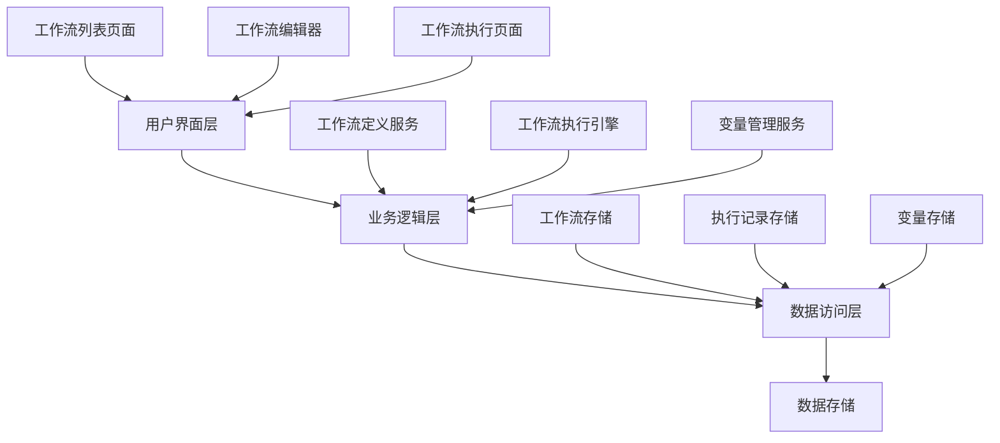

# 工作流模块设计总结

**版本号**: v1.0.0  
**创建时间**: 2025年3月13日  
**文档状态**: 初稿  

> 本文档是Netsphere工作流模块的综合设计总结，整合了所有细分文档的关键内容，作为开发团队的主要指导文件。

## 目录
1. [项目概述](#1-项目概述)
2. [关键设计决策](#2-关键设计决策)
3. [系统架构](#3-系统架构)
4. [功能模块](#4-功能模块)
5. [技术路线图](#5-技术路线图)
6. [集成战略](#6-集成战略)
7. [相关文档](#7-相关文档)

## 1. 项目概述

Netsphere工作流模块是系统中的核心功能模块，旨在提供直观的可视化工具，让用户能够设计和执行复杂的AI工作流。通过卡片拖拽和连接的方式，用户可以轻松构建自动化流程，组合利用NPC、AI服务和系统功能。

### 1.1 项目目标

- 实现可视化工作流设计和执行环境
- 集成现有NPC、变量和工作任务模块
- 提供简单易用的界面和灵活的功能扩展
- 确保系统性能、稳定性和可维护性

### 1.2 核心价值

工作流模块将成为Netsphere系统的顶层组件，整合其他所有基础模块，提供一站式的AI工作流自动化解决方案。其核心价值在于将分散的功能组件编排为可执行的工作流，显著提高用户工作效率。

## 2. 关键设计决策

在规划和设计工作流模块时，我们做出了以下关键决策：

### 2.1 技术栈选择

- **前端**：React + TypeScript + Ant Design
- **画布实现**：React Flow
- **状态管理**：React Context API
- **后端**：Node.js + Express + TypeScript
- **数据库**：SQLite（使用TypeORM）
- **通信**：REST API + WebSocket

### 2.2 UI/UX设计原则

- 采用卡片式设计，符合现有系统UI风格
- 拖拽操作为核心交互方式
- 分离编辑模式和使用模式，简化用户体验
- 响应式设计支持各种屏幕尺寸

### 2.3 开发策略

- 采用分阶段增量式开发
- 功能优先级明确：先核心，后扩展
- 从一开始就采用功能标记控制可见性
- 实现单线程内存队列，产品验证后再优化

## 3. 系统架构

工作流模块采用前后端分离的架构，前端负责可视化编辑和展示，后端负责数据存储和工作流执行。

### 3.1 整体架构图



### 3.2 核心数据模型

工作流模块的核心数据实体包括：

- **工作流**：定义工作流的基本信息
- **节点**：工作流中的卡片，包含不同类型和配置
- **连接**：节点之间的连线，定义执行流向
- **执行记录**：工作流执行的状态和结果

### 3.3 模块间通信

- **前后端通信**：REST API + JSON
- **实时状态更新**：WebSocket（工作流执行状态同步）
- **后端服务间通信**：直接函数调用

## 4. 功能模块

### 4.1 工作流列表

- 卡片式展示所有工作流
- 支持创建、复制、删除、编辑操作
- 提供搜索和筛选功能

### 4.2 工作流编辑器

- 左侧卡片选择区
- 中央画布区（React Flow）
- 支持拖拽、连接、编辑、删除操作
- 保存和加载工作流定义

### 4.3 卡片类型

第一阶段卡片：
- **起点卡**：工作流入口，接收用户输入
- **工作任务卡**：执行已创建的工作任务
- **赋值卡**：变量赋值操作
- **循环卡**：条件判断和循环控制
- **展示卡**：显示内容到输出区

后续计划卡片：
- **AI判断卡**：动态生成问题
- **子工作流卡**：嵌套调用其他工作流

### 4.4 执行引擎

- 节点执行器设计
- 变量解析和替换
- 执行状态跟踪
- 内存队列管理

### 4.5 使用界面

- 用户输入区
- 系统输出区
- 实时执行状态显示
- 结果导出功能

## 5. 技术路线图

工作流模块开发将分为四个阶段进行：

### 5.1 阶段一：数据模型和API基础 (1周)

- 设计并实现数据库表结构
- 实现核心API端点
- 前端服务层和基础组件设计

### 5.2 阶段二：工作流列表和编辑器基础 (2周)

- 工作流列表页面实现
- React Flow集成
- 基础编辑器功能

### 5.3 阶段三：卡片类型和执行引擎 (3周)

- 各类卡片组件实现
- 执行引擎开发
- 变量解析系统
- 执行状态可视化

### 5.4 阶段四：使用界面和系统集成 (2周)

- 使用界面实现
- WebSocket实时通信
- 与现有模块深度集成
- 性能优化和测试

## 6. 集成战略

为确保工作流模块与现有系统无缝集成，我们采用以下策略：

### 6.1 分支管理策略

采用功能分支工作流：

1. **主分支**：`master` - 与v0.1.1-stable同步，保持稳定
2. **开发分支**：`feature/workflow` - 工作流模块开发的主分支
3. **功能分支**：`feature/workflow/xxx` - 具体功能开发分支
4. **发布分支**：`release/workflow` - 发布准备分支
5. **修复分支**：`hotfix/xxx` - 紧急修复分支

### 6.2 功能标记控制

使用环境变量控制工作流功能的可见性，确保在功能未完成或测试未通过前不影响现有功能：

```typescript
// App.tsx
const ENABLE_WORKFLOW = process.env.ENABLE_WORKFLOW === 'true';

function App() {
  return (
    <Router>
      <Routes>
        {/* 现有路由 */}
        <Route path="/npc" element={<NpcListPage />} />
        <Route path="/variable" element={<VariableListPage />} />
        
        {/* 工作流路由 - 受功能标记控制 */}
        {ENABLE_WORKFLOW && (
          <>
            <Route path="/workflow" element={<WorkflowListPage />} />
            <Route path="/workflow/:id/edit" element={<WorkflowEditPage />} />
            <Route path="/workflow/:id/use" element={<WorkflowUsePage />} />
          </>
        )}
      </Routes>
    </Router>
  );
}
```

### 6.3 与现有模块集成

- **只读集成**：初期阶段工作流模块只读取现有模块数据，不直接修改
- **适配器模式**：为每个现有模块创建专门的适配器服务，隔离直接依赖
- **渐进式集成**：每完成一个集成点，立即进行回归测试，确保不影响原有功能

### 6.4 风险控制

- **数据库风险**：工作流相关表使用独立的命名空间前缀，确保不与现有表混淆
- **执行隔离**：工作流执行使用单独的队列和执行上下文，避免影响其他功能
- **回滚计划**：为每次部署准备详细的回滚步骤，确保可以快速恢复

## 7. 相关文档

工作流模块设计文档体系包括以下内容：

- [工作流模块概念设计](workflow-module-concept-design.md) - 描述了用户场景、功能需求和界面规范
- [工作流模块技术规范](workflow-module-technical-spec.md) - 详细说明技术架构、数据模型和实现策略
- [工作流模块API接口规范](workflow-module-api-spec.md) - 定义前后端交互的API接口
- [工作流模块UI组件规范](workflow-module-ui-component-spec.md) - 描述各类UI组件的设计和交互
- [工作流模块实施计划](workflow-module-implementation-plan.md) - 分解开发任务、定义验收标准和风险管理
