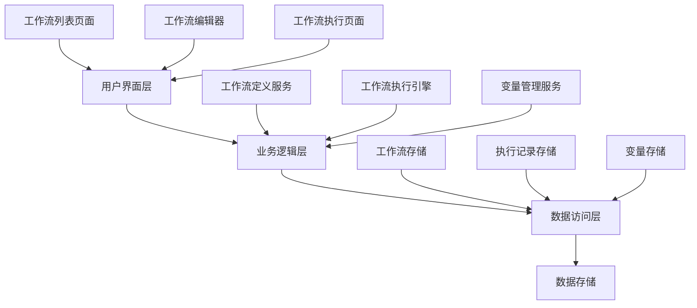

# 工作流模块技术规范

**版本号**: v1.0.0  
**创建时间**: 2025年3月13日  
**文档状态**: 初稿  

> 本文档是Netsphere工作流模块的技术规范，详细说明技术架构、数据模型和实现策略。
> 概念设计请参见：[工作流模块概念设计](workflow-module-concept-design.md)
> API接口详情请参见：[工作流模块API接口规范](workflow-module-api-spec.md)
> UI组件设计请参见：[工作流模块UI组件规范](workflow-module-ui-component-spec.md)

## 目录
1. [系统架构](#1-系统架构)
2. [数据模型](#2-数据模型)
3. [前端技术方案](#3-前端技术方案)
4. [后端技术方案](#4-后端技术方案)
5. [关键功能实现](#5-关键功能实现)
6. [与现有模块集成](#6-与现有模块集成)
7. [系统安全性](#7-系统安全性)

## 1. 系统架构

工作流模块采用前后端分离的架构，后端提供RESTful API，前端实现可视化编辑和执行。

### 1.1 整体架构图



### 1.2 前端架构

- **技术栈**：React + TypeScript + Ant Design
- **状态管理**：React Context API
- **画布实现**：React Flow
- **路由管理**：React Router

### 1.3 后端架构

- **技术栈**：Node.js + Express + TypeScript
- **数据访问**：TypeORM
- **数据库**：SQLite
- **API设计**：RESTful

### 1.4 模块间通信

- **前后端通信**：REST API + JSON
- **实时状态更新**：WebSocket（工作流执行状态同步）
- **后端服务间通信**：直接函数调用

## 2. 数据模型

### 2.1 核心数据实体

#### 工作流表 (workflows)
```typescript
@Entity("workflows")
export class Workflow {
  @PrimaryGeneratedColumn("uuid")
  id: string;
  
  @Column({ length: 100 })
  name: string;
  
  @Column("text", { nullable: true })
  description: string;
  
  @Column("simple-json")
  metadata: {
    createdAt: Date;
    updatedAt: Date;
    lastRunAt?: Date;
    version: number;
  };
  
  @Column({ default: false })
  isActive: boolean;
  
  @CreateDateColumn()
  createdAt: Date;
  
  @UpdateDateColumn()
  updatedAt: Date;
}
```

#### 工作流节点表 (workflow_nodes)
```typescript
export enum NodeType {
  START = 'start',
  WORK_TASK = 'work_task',
  DISPLAY = 'display',
  ASSIGNMENT = 'assignment',
  LOOP = 'loop',
  AI_JUDGMENT = 'ai_judgment',
  WORKFLOW = 'workflow'  // 嵌套工作流
}

@Entity("workflow_nodes")
export class WorkflowNode {
  @PrimaryGeneratedColumn("uuid")
  id: string;
  
  @Column()
  workflowId: string;
  
  @ManyToOne(() => Workflow)
  @JoinColumn()
  workflow: Workflow;
  
  @Column({
    type: "varchar",
    enum: NodeType
  })
  type: NodeType;
  
  @Column({ length: 100, nullable: true })
  name: string;
  
  @Column("simple-json")
  position: {
    x: number;
    y: number;
  };
  
  @Column("simple-json")
  config: any;  // 节点特定配置
  
  @Column("simple-json", { nullable: true })
  data: any;  // 节点运行时数据
  
  @CreateDateColumn()
  createdAt: Date;
  
  @UpdateDateColumn()
  updatedAt: Date;
}
```

#### 工作流连接表 (workflow_connections)
```typescript
@Entity("workflow_connections")
export class WorkflowConnection {
  @PrimaryGeneratedColumn("uuid")
  id: string;
  
  @Column()
  workflowId: string;
  
  @ManyToOne(() => Workflow)
  @JoinColumn()
  workflow: Workflow;
  
  @Column()
  sourceNodeId: string;
  
  @ManyToOne(() => WorkflowNode)
  @JoinColumn()
  sourceNode: WorkflowNode;
  
  @Column()
  targetNodeId: string;
  
  @ManyToOne(() => WorkflowNode)
  @JoinColumn()
  targetNode: WorkflowNode;
  
  @Column({ nullable: true })
  label: string;  // 例如"Yes"/"No"
  
  @Column("simple-json", { nullable: true })
  config: any;  // 连接特定配置
  
  @CreateDateColumn()
  createdAt: Date;
  
  @UpdateDateColumn()
  updatedAt: Date;
}
```

#### 工作流执行记录表 (workflow_executions)
```typescript
export enum ExecutionStatus {
  IDLE = 'idle',
  RUNNING = 'running',
  COMPLETED = 'completed',
  FAILED = 'failed',
  CANCELED = 'canceled',
  WAITING = 'waiting'
}

@Entity("workflow_executions")
export class WorkflowExecution {
  @PrimaryGeneratedColumn("uuid")
  id: string;
  
  @Column()
  workflowId: string;
  
  @ManyToOne(() => Workflow)
  @JoinColumn()
  workflow: Workflow;
  
  @Column({
    type: "varchar",
    enum: ExecutionStatus,
    default: ExecutionStatus.IDLE
  })
  status: ExecutionStatus;
  
  @Column("simple-json", { nullable: true })
  input: any;  // 工作流输入数据
  
  @Column("simple-json", { nullable: true })
  output: any;  // 工作流输出数据
  
  @Column("simple-json")
  nodeStates: {  // 各节点执行状态
    [nodeId: string]: {
      status: ExecutionStatus;
      startTime?: Date;
      endTime?: Date;
      runCount: number;
      output?: any;
    }
  };
  
  @Column("text", { nullable: true })
  error: string;
  
  @Column({ nullable: true })
  startedAt: Date;
  
  @Column({ nullable: true })
  completedAt: Date;
  
  @CreateDateColumn()
  createdAt: Date;
  
  @UpdateDateColumn()
  updatedAt: Date;
}
```

### 2.2 工作流变量类型

为全局变量添加工作流卡片类型：

```typescript
export enum VariableSourceType {
  NPC = 'npc',
  WORK_TASK = 'work_task',
  WORKFLOW_CARD = 'workflow_card'  // 新增类型
}
```

## 3. 前端技术方案

### 3.1 React Flow 画布实现

工作流编辑器的核心是画布的实现，我们选择React Flow作为实现方案：

#### 3.1.1 React Flow 选择理由

- 专为React设计的流程图库
- 提供完整的TypeScript支持
- 内置拖拽、连接、自定义节点等功能
- 活跃的社区和完善的文档
- 与现有技术栈高度契合

#### 3.1.2 核心实现示例

```tsx
import ReactFlow, { 
  Controls, 
  Background,
  addEdge,
  Node,
  Edge
} from 'reactflow';
import 'reactflow/dist/style.css';

// 自定义节点类型
const nodeTypes = {
  startNode: StartNodeComponent,
  workTaskNode: WorkTaskNodeComponent,
  displayNode: DisplayNodeComponent,
  assignmentNode: AssignmentNodeComponent,
  loopNode: LoopNodeComponent
};

// 自定义边类型
const edgeTypes = {
  yesNoEdge: YesNoEdgeComponent,
  defaultEdge: DefaultEdgeComponent
};

const WorkflowEditor = () => {
  const [nodes, setNodes] = useState<Node[]>([]);
  const [edges, setEdges] = useState<Edge[]>([]);
  
  // 处理连接创建
  const onConnect = useCallback(
    (params) => setEdges((eds) => addEdge(params, eds)),
    [setEdges]
  );
  
  // 处理拖拽放置
  const onDrop = useCallback(
    (event) => {
      // 处理从卡片选择区拖入的新卡片
      const type = event.dataTransfer.getData('application/reactflow');
      const position = rfInstance.project({
        x: event.clientX,
        y: event.clientY,
      });
      
      // 创建新节点
      const newNode = {
        id: `node_${Date.now()}`,
        type,
        position,
        data: { /* 初始数据 */ },
      };
      
      setNodes((nds) => nds.concat(newNode));
    },
    [rfInstance, setNodes]
  );
  
  return (
    <div style={{ height: 800 }}>
      <ReactFlow
        nodes={nodes}
        edges={edges}
        nodeTypes={nodeTypes}
        edgeTypes={edgeTypes}
        onConnect={onConnect}
        onDrop={onDrop}
        onDragOver={(event) => {
          event.preventDefault();
          event.dataTransfer.dropEffect = 'move';
        }}
        fitView
      >
        <Background />
        <Controls />
      </ReactFlow>
    </div>
  );
};
```

### 3.2 状态管理方案

使用React Context管理工作流编辑器状态：

```typescript
// WorkflowContext.tsx
import { createContext, useState, useContext, useCallback } from 'react';

const WorkflowContext = createContext(null);

export const WorkflowProvider = ({ children }) => {
  const [nodes, setNodes] = useState([]);
  const [edges, setEdges] = useState([]);
  const [selectedNodeId, setSelectedNodeId] = useState(null);
  
  // 加载工作流
  const loadWorkflow = useCallback(async (workflowId) => {
    const data = await apiService.getWorkflow(workflowId);
    setNodes(data.nodes);
    setEdges(data.edges);
  }, []);
  
  // 保存工作流
  const saveWorkflow = useCallback((workflowId) => {
    return apiService.saveWorkflow(workflowId, { nodes, edges });
  }, [nodes, edges]);
  
  // 添加节点
  const addNode = useCallback((nodeData) => {
    setNodes(nodes => [...nodes, nodeData]);
  }, []);
  
  // 更新节点
  const updateNode = useCallback((nodeId, updateData) => {
    setNodes(nodes => 
      nodes.map(node => node.id === nodeId ? { ...node, ...updateData } : node)
    );
  }, []);
  
  // 提供的上下文值
  const contextValue = {
    nodes,
    edges,
    selectedNodeId,
    setSelectedNodeId,
    loadWorkflow,
    saveWorkflow,
    addNode,
    updateNode,
    // 其他方法...
  };
  
  return (
    <WorkflowContext.Provider value={contextValue}>
      {children}
    </WorkflowContext.Provider>
  );
};

// 自定义Hook便于使用Context
export const useWorkflow = () => {
  const context = useContext(WorkflowContext);
  if (!context) {
    throw new Error('useWorkflow must be used within WorkflowProvider');
  }
  return context;
};
```

### 3.3 卡片组件继承结构

采用基础抽象组件设计，实现代码复用和统一UI：

```tsx
// BaseCardNode.tsx
interface BaseCardNodeProps {
  id: string;
  data: {
    type: string;
    label: string;
    config: any;
    [key: string]: any;
  };
  selected: boolean;
  // 其他共有属性
}

const BaseCardNode: React.FC<BaseCardNodeProps> = ({ 
  id, data, selected, ...props 
}) => {
  // 共享的删除处理
  const onDeleteClick = useCallback(() => {
    // 删除节点逻辑
  }, [id]);
  
  // 共享的选择样式
  const borderStyle = selected 
    ? '2px solid #1890ff' 
    : '1px solid #d9d9d9';
  
  return (
    <div 
      className="card-node"
      style={{ 
        padding: 16, 
        borderRadius: 8,
        border: borderStyle,
        background: '#fff',
        minWidth: 180,
        // 其他样式
      }}
    >
      {/* 通用头部 */}
      <div className="card-node-header">
        <div className="card-node-title">{data.label}</div>
        <Button 
          type="text" 
          icon={<DeleteOutlined />} 
          onClick={onDeleteClick} 
          size="small"
        />
      </div>
      
      {/* 内容区 - 由子类实现 */}
      <div className="card-node-content">
        {props.children}
      </div>
      
      {/* 通用连接点 */}
      <Handle
        type="target"
        position={Position.Top}
        isConnectable={true}
      />
      <Handle
        type="source"
        position={Position.Bottom}
        isConnectable={true}
      />
    </div>
  );
};
```

各卡片类型继承基础组件：

```tsx
// StartCardNode.tsx
import BaseCardNode from './BaseCardNode';

const StartCardNode: React.FC<NodeProps> = ({ id, data, selected }) => {
  return (
    <BaseCardNode id={id} data={data} selected={selected}>
      <Input 
        placeholder="输入提示文本"
        value={data.promptText}
        onChange={(e) => {
          // 更新提示文本
        }}
      />
      <div className="variable-identifier">
        @{data.workflowName}.start
      </div>
    </BaseCardNode>
  );
};
```

## 4. 后端技术方案

### 4.1 API设计原则

1. **RESTful风格**：遵循REST设计规范
2. **版本控制**：API路径包含版本号
3. **统一响应格式**：标准化错误和成功响应
4. **权限控制**：基于角色的访问控制

### 4.2 工作流存储设计

工作流定义采用以下格式序列化存储：

```typescript
interface WorkflowDefinition {
  id: string;
  name: string;
  description?: string;
  version: number;
  nodes: WorkflowNode[];
  edges: WorkflowEdge[];
  metadata: {
    createdAt: Date;
    updatedAt: Date;
    lastRunAt?: Date;
  };
}
```

### 4.3 执行引擎设计

工作流执行引擎是后端的核心组件，负责解析工作流定义并按照既定规则执行。

```typescript
class WorkflowExecutionEngine {
  private workflowService: WorkflowService;
  private variableService: VariableService;
  private workTaskService: WorkTaskService;
  
  constructor(
    workflowService: WorkflowService,
    variableService: VariableService,
    workTaskService: WorkTaskService
  ) {
    this.workflowService = workflowService;
    this.variableService = variableService;
    this.workTaskService = workTaskService;
  }
  
  async executeWorkflow(workflowId: string, input?: any): Promise<WorkflowExecution> {
    // 1. 创建执行记录
    const execution = await this.createExecutionRecord(workflowId, input);
    
    try {
      // 2. 加载工作流定义
      const workflow = await this.workflowService.getWorkflowWithNodesAndEdges(workflowId);
      
      // 3. 找到起点节点
      const startNode = workflow.nodes.find(node => node.type === NodeType.START);
      if (!startNode) {
        throw new Error('工作流缺少起点节点');
      }
      
      // 4. 从起点开始执行
      await this.executeNode(startNode, execution, workflow, input);
      
      // 5. 更新执行状态
      execution.status = ExecutionStatus.COMPLETED;
      execution.completedAt = new Date();
      
      return await this.workflowService.updateExecution(execution);
    } catch (error) {
      // 处理执行错误
      execution.status = ExecutionStatus.FAILED;
      execution.error = error.message;
      return await this.workflowService.updateExecution(execution);
    }
  }
  
  private async executeNode(
    node: WorkflowNode, 
    execution: WorkflowExecution,
    workflow: Workflow,
    contextData: any
  ): Promise<void> {
    // 更新节点状态为运行中
    this.updateNodeStatus(execution, node.id, ExecutionStatus.RUNNING);
    
    try {
      // 根据节点类型执行不同逻辑
      let result;
      switch (node.type) {
        case NodeType.START:
          result = contextData;
          break;
        case NodeType.WORK_TASK:
          result = await this.executeWorkTaskNode(node, contextData);
          break;
        case NodeType.ASSIGNMENT:
          result = await this.executeAssignmentNode(node, contextData);
          break;
        case NodeType.LOOP:
          result = await this.executeLoopNode(node, execution, workflow, contextData);
          break;
        case NodeType.DISPLAY:
          result = await this.executeDisplayNode(node, contextData);
          break;
        default:
          throw new Error(`不支持的节点类型: ${node.type}`);
      }
      
      // 更新节点状态为完成
      this.updateNodeStatus(
        execution, 
        node.id, 
        ExecutionStatus.COMPLETED, 
        { output: result }
      );
      
      // 查找并执行下一个节点
      await this.executeNextNodes(node, execution, workflow, result);
    } catch (error) {
      // 更新节点状态为失败
      this.updateNodeStatus(
        execution, 
        node.id, 
        ExecutionStatus.FAILED,
        { error: error.message }
      );
      throw error;
    }
  }
  
  // 其他方法实现...
}
```

### 4.4 内存队列实现

初期采用内存队列管理工作流执行：

```typescript
class WorkflowExecutionQueue {
  private queue: string[] = []; // 存储工作流执行ID
  private isProcessing: boolean = false;
  private executionEngine: WorkflowExecutionEngine;
  
  constructor(executionEngine: WorkflowExecutionEngine) {
    this.executionEngine = executionEngine;
  }
  
  // 添加工作流到队列
  enqueue(executionId: string): void {
    this.queue.push(executionId);
    this.processQueue();
  }
  
  // 处理队列
  private async processQueue(): Promise<void> {
    if (this.isProcessing || this.queue.length === 0) {
      return;
    }
    
    this.isProcessing = true;
    
    try {
      const executionId = this.queue.shift();
      await this.executionEngine.executeWorkflowById(executionId);
    } catch (error) {
      console.error('工作流执行错误:', error);
    } finally {
      this.isProcessing = false;
      this.processQueue(); // 处理下一个
    }
  }
}
```

## 5. 关键功能实现

### 5.1 变量解析与替换

工作流执行时需要解析和替换变量引用：

```typescript
class VariableResolver {
  private variableService: VariableService;
  
  constructor(variableService: VariableService) {
    this.variableService = variableService;
  }
  
  // 解析文本中的变量引用
  async resolveText(text: string, maxDepth: number = 5): Promise<string> {
    if (maxDepth <= 0) {
      throw new Error('变量解析达到最大深度，可能存在循环引用');
    }
    
    // 匹配 @来源.字段 格式的变量引用
    const variablePattern = /@([^.]+)\.([^\s.,;:!?()[\]{}]+)/g;
    
    // 查找所有变量引用
    const matches = [...text.matchAll(variablePattern)];
    if (matches.length === 0) {
      return text; // 没有变量引用，直接返回原文本
    }
    
    // 替换所有变量引用
    let resolvedText = text;
    for (const match of matches) {
      const [fullMatch, source, field] = match;
      
      // 获取变量值
      const value = await this.variableService.getVariableValue(source, field);
      
      if (value !== undefined) {
        // 替换变量引用为实际值
        resolvedText = resolvedText.replace(fullMatch, value);
        
        // 递归解析，以处理嵌套变量
        resolvedText = await this.resolveText(resolvedText, maxDepth - 1);
      }
    }
    
    return resolvedText;
  }
}
```

### 5.2 卡片执行实现

各类型卡片的执行逻辑：

```typescript
// 在WorkflowExecutionEngine类中

// 执行工作任务卡
private async executeWorkTaskNode(node: WorkflowNode, contextData: any): Promise<any> {
  const { workTaskId } = node.config;
  
  // 解析工作任务的输入
  const resolvedInput = await this.variableResolver.resolveText(node.config.input);
  
  // 执行工作任务
  const result = await this.workTaskService.executeTask(workTaskId, resolvedInput);
  
  // 更新工作任务输出变量
  await this.variableService.setVariableValue(
    node.config.variableSource,
    'output',
    result.output
  );
  
  return result.output;
}

// 执行赋值卡
private async executeAssignmentNode(node: WorkflowNode, contextData: any): Promise<any> {
  const { assignments } = node.config;
  
  // 依次执行所有赋值规则
  for (const assignment of assignments) {
    const { sourceVariable, targetVariable } = assignment;
    
    // 解析源变量
    const [sourceSource, sourceField] = sourceVariable.split('.');
    const sourceValue = await this.variableService.getVariableValue(sourceSource, sourceField);
    
    // 设置目标变量
    const [targetSource, targetField] = targetVariable.split('.');
    await this.variableService.setVariableValue(targetSource, targetField, sourceValue);
  }
  
  return { message: '赋值完成', assignments: assignments.length };
}

// 执行循环卡
private async executeLoopNode(
  node: WorkflowNode, 
  execution: WorkflowExecution,
  workflow: Workflow,
  contextData: any
): Promise<any> {
  const { conditionType, conditionConfig } = node.config;
  
  // 获取节点当前运行次数
  const nodeState = execution.nodeStates[node.id] || { runCount: 0 };
  const runCount = nodeState.runCount || 0;
  
  // 判断条件是否满足
  let conditionMet = false;
  
  if (conditionType === 'runCount') {
    // 运行次数条件
    conditionMet = runCount < conditionConfig.maxRuns;
  } else if (conditionType === 'variableValue') {
    // 变量值条件
    const { variablePath, expectedValue } = conditionConfig;
    const [source, field] = variablePath.split('.');
    const value = await this.variableService.getVariableValue(source, field);
    conditionMet = value === expectedValue;
  }
  
  // 查找并执行下一个节点
  const outgoingEdges = workflow.edges.filter(edge => edge.sourceNodeId === node.id);
  
  for (const edge of outgoingEdges) {
    const isYesBranch = edge.label === 'Yes';
    
    // 根据条件和分支标签决定是否执行
    if ((conditionMet && isYesBranch) || (!conditionMet && !isYesBranch)) {
      const targetNode = workflow.nodes.find(n => n.id === edge.targetNodeId);
      if (targetNode) {
        await this.executeNode(targetNode, execution, workflow, contextData);
      }
    }
  }
  
  return { conditionMet, runCount };
}

// 执行展示卡
private async executeDisplayNode(node: WorkflowNode, contextData: any): Promise<any> {
  const { variablePath, displayMode } = node.config;
  
  // 获取要显示的变量值
  const [source, field] = variablePath.split('.');
  const content = await this.variableService.getVariableValue(source, field);
  
  // 根据显示模式处理
  // 这里只是记录显示内容，实际显示由前端处理
  return {
    content,
    displayMode,
    timestamp: new Date().toISOString()
  };
}
```

### 5.3 连接规则实现

```typescript
// 在WorkflowExecutionEngine类中

// 查找并执行下一个节点
private async executeNextNodes(
  currentNode: WorkflowNode,
  execution: WorkflowExecution,
  workflow: Workflow,
  contextData: any
): Promise<void> {
  // 查找从当前节点出发的所有连接
  const outgoingEdges = workflow.edges.filter(
    edge => edge.sourceNodeId === currentNode.id
  );
  
  // 如果是循环卡，连接的执行已在executeLoopNode中处理
  if (currentNode.type === NodeType.LOOP) {
    return;
  }
  
  // 对于其他卡片类型，执行所有下游节点
  for (const edge of outgoingEdges) {
    const targetNode = workflow.nodes.find(node => node.id === edge.targetNodeId);
    if (targetNode) {
      await this.executeNode(targetNode, execution, workflow, contextData);
    }
  }
}
```

## 6. 与现有模块集成

### 6.1 集成原则

为确保工作流模块不干扰现有功能，采用以下集成策略：

1. **只读集成**：初期阶段只读取现有模块数据，不直接修改
2. **适配器模式**：为每个现有模块创建专门的适配器服务
3. **功能标记**：使用功能标记控制工作流功能的可见性

### 6.2 与变量系统集成

```typescript
// 工作流变量源提供者
class WorkflowVariableSourceProvider implements VariableSourceProvider {
  private workflowService: WorkflowService;
  
  constructor(workflowService: WorkflowService) {
    this.workflowService = workflowService;
  }
  
  // 获取源类型
  getSourceType(): string {
    return 'workflow_card';
  }
  
  // 获取源信息
  async getSources(): Promise<VariableSource[]> {
    const workflows = await this.workflowService.getAllWorkflows();
    
    return workflows.map(workflow => ({
      id: workflow.id,
      name: workflow.name,
      type: 'workflow_card'
    }));
  }
  
  // 获取字段信息
  async getFields(sourceId: string): Promise<VariableField[]> {
    // 根据节点类型返回不同字段
    const workflow = await this.workflowService.getWorkflowWithNodes(sourceId);
    const fields: VariableField[] = [];
    
    // 添加起点节点的start
